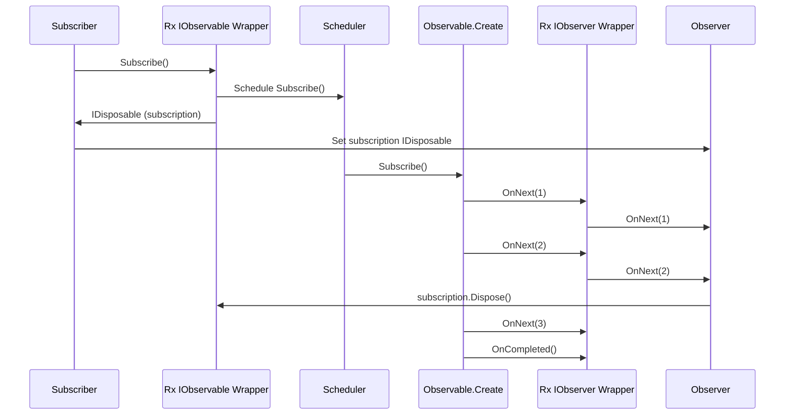

```mermaid
sequenceDiagram
    participant Subscriber as Subscriber
    participant SrcWrapper as Rx IObservable Wrapper
    participant Scheduler as Scheduler
    participant Observable as Observable.Create
    participant RcvWrapper as Rx IObserver Wrapper
    participant Observer as Observer
    Subscriber->>SrcWrapper: Subscribe()
    SrcWrapper->>Scheduler: Schedule Subscribe()
    SrcWrapper->>Subscriber: IDisposable (subscription)
    Subscriber->>Observer: Set subscription IDisposable
    Scheduler->>Observable: Subscribe()
    Observable->>RcvWrapper: OnNext(1)
    RcvWrapper->>Observer: OnNext(1)
    Observable->>RcvWrapper: OnNext(2)
    RcvWrapper->>Observer: OnNext(2)
    Observer->>SrcWrapper: subscription.Dispose()
    Observable->>RcvWrapper: OnNext(3)
    Observable->>RcvWrapper: OnCompleted()
```