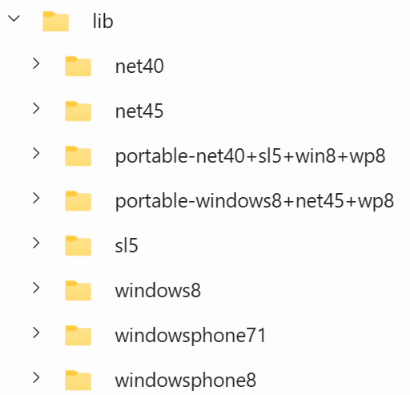

# Windows TFMs and Desktop Framework Dependencies

When a .NET project that targets Windows takes a dependency on `System.Reactive`, there are circumstances in which this causes unwanted dependencies on the WPF and Windows Forms frameworks. This can add tens of megabytes to the deployable size of applications. It has caused some projects to abandon Rx entirely.

For example, [Avalonia removed all use of Rx.NET](https://github.com/AvaloniaUI/Avalonia/pull/9749) in January 2023. In the discussion of https://github.com/dotnet/reactive/issues/1461 you'll see some people talking about not being able to use Rx because of this problem.

The view of the Rx .NET maintainers is that projects using Rx should not be forced into this situation. There are a lot of subtleties and technical complexity here, but the bottom line is that we want Rx to be an attractive choice.

Since this topic was first raised, we have discovered that there is a [workaround](#the-workaround) to the problem. Back when [endjin](https://endjin.com) took over maintenance and development of Rx .NET at the start of 2023, it was believed that there was no workaround, so our plan was that Rx 7.0 would address this problem, possibly making radical changes (e.g., introducing a new 'main' Rx package, with `System.Reactive` being the sad casualty of an unfortunate technical decision made half a decade ago). But now that a workaround has been identified, the pressure to make changes soon has been removed. It seems that Rx 6.0 can be used in a way that doesn't encounter these problems, so we now think that a less radical, more gradual longer-term plan is a better bet. We can deprecate the parts of the library that caused this problem and introduce replacements in other components, with a long term plan of eventually removing them from `System.Reactive`, at which point the workaround would no longer be required. The process of deprecation could begin now, but it would likely be many years before we reach the ends state.

This document explains the root causes of the problem, the current [workaround](#the-workaround), the eventual desired state of Rx .NET, and the path that will get us there.


## Status

Draft


## Authors

@idg10 ([Ian Griffiths](https://endjin.com/who-we-are/our-people/ian-griffiths/)).


## Context

To decide on a good solution, we need to take a lot of information into account. It is first necessary to characterise [the problem](#the-problem) clearly. It is also necessary to understand [the history that led up to the problem](#the-road-to-the-current-problem). The proposed [workaround](#the-workaround) needs to be understood in detail. We [started a public discussion](https://github.com/dotnet/reactive/discussions/2038) of this problem, and have received a great deal of [useful input from the Rx.NET community](#community-input). There are [several ways we could try to solve this](#the-design-options), and them must each be evaluated in the light of all the other information.

The following sections address all of this before moving onto a [decision](#decision).

### The problem

The basic problem is described at the start of this document, but we can characterise it more precisely:

> An application that references `System.Reactive` (directly or transitively) and which has a Windows-specific target specifying a version of `10.0.19041` will acquire a dependency on the [.NET Windows Desktop Runtime](https://github.com/dotnet/windowsdesktop). The [`UseWPF`](https://learn.microsoft.com/en-us/dotnet/core/project-sdk/msbuild-props-desktop#usewpf) and [`UseWindowsForms`](https://learn.microsoft.com/en-us/dotnet/core/project-sdk/msbuild-props-desktop#usewindowsforms) properties will have been set to `true`.
>
> This causes a problem for self-contained deployment (and, by extension, Native AOT) because it means those deployments end up including complete copies of those frameworks. This can add many tens of megabytes to the application in its final deployable form. This is especially frustrating for applications that don't use either WPF or Windows Forms.

That "or transitively" in the first parenthetical is easily overlooked, but is very important. Some developers have found themselves encountering this problem not because their applications use `System.Reactive` directly, but because they are using some library that depends on it. Many simple and initially plausible-looking solutions proposed to the problem this ADR addresses founder in cases where an application acquires a dependency to Rx.NET transitively, especially when it does so through multiple different references, and to different versions.


### The road to the current problem

This problem arose from a series of changes that were intended to solve other problems. We need to ensure that we don't reintroduce any of these older problems, so it's important to have a good understanding of the following factors that led to the current design:

1. the long history of confusion in Rx's package structure
2. the subtle problems that could occur when plug-ins use Rx
3. the [_great unification_](https://github.com/dotnet/reactive/issues/199) in Rx 4.0 that solved the first two problems
4. changes in .NET Core 3.0 which, in combination with the _great unification_, caused the problem that this ADR aims to solve

#### Rx's history of confusing packaging

The first public previews of Rx appeared back in 2009 before NuGet was a thing. This meant Rx was initially distributed in the old-fashioned way: you installed an SDK on development machines that made Rx's assemblies available for local development, and had to arrange to copy the necessary files onto target machines as part of your application's installation or deployment process. By the time [the first supported Rx release shipped in June 2011](https://web.archive.org/web/20110810091849/http://www.microsoft.com/download/en/details.aspx?id=26649), NuGet did exist, but it was early days, so for quite a while Rx had [two official distribution channels: NuGet and an installable SDK](https://cc.bingj.com/cache.aspx?q=microsoft+download+reactive+extension+sdk&d=5018270206749605&mkt=en-GB&setlang=en-GB&w=LCqKaZy3VgjqC_Zlig1e4qmTo82s8qt5).

There were several different versions of .NET around at this time besides the .NET Framework. (This was a long time before .NET Core, by the way.) Silverlight and Windows Phone both had their own runtimes, and the latter had a version of Rx preinstalled. Windows 8 had its own version of .NET that worked quite differently from anything else. These all had very different subsections of the .NET runtime class libraries, especially when it came to threading support. Rx was slightly different on each of these platforms because attempting to target the lowest common denominator would have meant sub-optimal performance everywhere. There were two main ways in which each of the different Rx versions varied:

* The scheduler support was specialized to work as well as possible on each distinct target
* Each platform had a different UI framework (or frameworks) available, so Rx's UI framework integration was different for each target

Some of the differences in the first category were implementation details behind an API common to all versions, but there were some public API differences too. The second category was all about differences in the public API, although at this point in Rx's history, the UI-framework-specific code was in separate assemblies. But there was a common core to Rx's public API that was the same across all platforms.

This meant that it would be possible, in principle, to write a library that depended on Rx, and which could be used on all the same platforms that Rx supported. However, it wasn't entirely straightforward to do this back in 2011.

This was years before .NET Standard was introduced, and at the time, if you wanted to write cross-platform libraries, you had to create something called a Portable Class Library (PCL). Rx wanted to offer a common API across all platforms while also providing optimized platform-specific schedulers, so it introduced a platform abstraction layer and a system it called "enlightenments" (named after a similar feature in Virtual Machine architectures). This worked, but resulted in a somewhat confusing proliferation of DLLs. Understanding which component your applications or libraries should reference in order to use Rx, and understanding which particular DLLs needed to be deployed was not easy, and presented a barrier to adoption for new users.

An additional dimension to the confusion is that even within any single target platform, Rx was split across several different components, and it wasn't entirely obvious why. There was a separate `System.Reactive.Interfaces` component defining the core interfaces Rx defines that aren't in the runtime libraries such as `IScheduler` and `ISubject<T>`. The the original idea behind this was that this would be a stable component that didn't need frequent releases because the expectation was that the core Rx interfaces would change very rarely. That expectation was proven correct over time, but unfortunately, the rationale behind the packaging decision was apparently forgotten, because instead of `System.Reactive.Interfaces` v2.0.0 being the one true definition for all time, new versions of this component were produced with each new version of Rx even when nothing changed. The defeated the entire purpose of having a separate component for the core interfaces.

(In fact things were a little weirder because some of the versions of .NET supported by Rx 1.0 defined the core `IObservable<T>` and `IObserver<T>` interfaces in the runtime class libraries but some did not. These interfaces were not present in .NET 3.5, for example, which Rx 1.0 supported. So Rx had to bring its own definition of these for some platforms. You might expect these to live in `System.Reactive.Interfaces` but they did not, because Microsoft wanted that package to be the same on all platforms. So on platforms where `IObversable/er<T>` were not built in, there was yet another DLL in the mix, further adding to the confusion around exactly what assemblies you needed to ship with your app if you wanted to use Rx.)

The other splits were also a bit hard to comprehend—it's not obvious why the LINQ parts of Rx are in their own package. In practice, anyone using Rx is going to use its LINQ features.

The 'platform services' part is arguably slightly easier to understand because .NET developers at this time were generally aware that there were lots of flavours of .NET each with slightly different characteristics. Even then, understanding how that worked in practice was tricky, and this was just another bit of complexity that could make Rx harder to use.

The NuGet distribution of Rx introduced a simplifying concept in v2.2: Rx was still fragmented across multiple components at this point, but the simplifying move was to define NuGet metapackages enabling you to use just a single package reference for basic Rx usage. For example, a single reference to `Rx-Main` v2.2.0 would give you everything you needed to use Rx. There were additional metapackages appropriate for using specific UI frameworks with Rx.

Because Rx has always supported many different runtimes, there were several different builds of each component. For quite a long time, there were different copies of Rx for different versions of .NET Framework. In Rx 2.2.0, there was one targetting .NET Framework 4.0, and another targetting .NET Framework 4.5. NuGet can cope with this—you just end up with `net40` and `net45` subfolders under `lib`. And the idea is that the .NET SDK will work out which one to use based on the runtime you target.

So there were effectively two dimensions of fragmentation. First, behind each metapackage there were multiple NuGet packages. (The Rx 2.0 [`Rx-Main` metapackage](https://www.nuget.org/packages/Rx-Main/2.2.0#dependencies-body-tab) depends on [`Rx-Core`](https://www.nuget.org/packages/Rx-Core/2.2.0), [`Rx-Interfaces`](https://www.nuget.org/packages/Rx-Interfaces/2.2.0), [`Rx-Linq`](https://www.nuget.org/packages/Rx-Linq/2.2.0) and [`Rx-PlatformServices`](https://www.nuget.org/packages/Rx-PlatformServices/2.2.0), for example. And just to add to the confusion, the package names aren't the same as the names of the assemblies they contain. These four packages provide `System.Reactive.Core.dll`, `System.Reactive.Interfaces.dll`, `System.Reactive.Linq.dll`, and `System.Reactive.PlatformServices.dll` respectively.) And then each of those packages contained multiple versions of what was, conceptually speaking, the same assembly (but with various technical differences due to differences between the target platforms). For example, if you [look inside `Rx-Core` 2.2.0](https://nuget.info/packages/Rx-Core/2.2.0) you'll see its `lib` folder contains 8 folders



It's the same story for [`Rx-Interfaces`](https://nuget.info/packages/Rx-Interfaces/2.2.0) and [`Rx-Linq`](https://nuget.info/packages/Rx-Linq/2.2.0). And it's almost the same for [`Rx-PlatformServices`](https://nuget.info/packages/Rx-PlatformServices/2.2.0) except for some reason that doesn't have the `portable-windows8+net45+wp8`.

Each of these subfolders of the NuGet pacakges `lib` folder contains a version of the assembly for that package. So `Rx-Core` contains 8 copies of `System.Reactive.Core.dll`, `Rx-Interfaces` contains 8 copies of `System.Reactive.Interfaces.dll`, `Rx-Linq` contains 8 copies of `System.Reactive.Linq.dll`, and `Rx-Core` contains 7 copies of `System.Reactive.PlatformServices.dll`. So conceptually we've got 4 assemblies here, but because of all the different builds, there are actually 31 files!

#### Plug-in problems

This fragmentation caused a problem with plug-in systems. People often ran into this when writing extensions for Visual Studio. Visual Studio was a common place to have these problems simply because a lot of people wrote extensions for it. Any .NET Framework based application with a plug-in based extensibility mechanism could have the same problems.

If one plug-in was written to use Rx.NET and if that plug-in was compiled for .NET Framework 4.0, deploying that plug-in would entail providing a copy of the assemblies from the `net40` folder of each of the four packages referenced by `Rx-Main`. If another plug-in was also written to use the same version of Rx.NET but was compiled for .NET Framework 4.5, its deployment files would include the DLLs from the `net45` folders of each of these pages.

Visual Studio is capable of loading components compiled for older versions of .NET Framework, so a version of Visual Studio running on .NET Framework 4.5 would happily load either of these plug-ins. But if it ended up loading both, that would mean that each plug-in was trying to supply its own set of Rx DLLs. And that caused a problem.

Here's what would happen. Let's say a we have two plug-ins, `PlugInOneBuiltFor40` and `PlugInTwoBuiltFor45`. Both were built with a reference to `Rx-Main` 2.2.0. That means that if we were to look at how these plug-ins looked on disk once they had been installed in the target application, we'd see something like this:

* `PlugInInstallationFolder`
  * `PlugInOneBuiltFor40`
    * `PlugInOneBuiltFor40.dll`
    * `System.Reactive.Core.dll` v2.2.0 (`net40` build)
    * `System.Reactive.Interfaces.dll` v2.2.0 (`net40` build)
    * `System.Reactive.Linq.dll` v2.2.0 (`net40` build)
    * `System.Reactive.PlatformServices.dll` v2.2.0 (`net40` build)
  * `PlugInTwoBuiltFor45`
    * `PlugInTwoBuiltFor45.dll`
    * `System.Reactive.Core.dll` v2.2.0 (`net45` build)
    * `System.Reactive.Interfaces.dll` v2.2.0 (`net45` build)
    * `System.Reactive.Linq.dll` v2.2.0 (`net45` build)
    * `System.Reactive.PlatformServices.dll` v2.2.0 (`net45` build)

The critical thing to notice here is that for each of the four Rx assemblies, we have two copies, one built for .NET 4.0 and one build for .NET 4.5. Crucially _they have the same version number_. In all cases they come from a NuGet package with version 2.2.0. But for the problems I'm describing, what matters more is the .NET assembly version numbers. (.NET versioning is a separate mechanism from NuGet versioning. There's no rule requiring these two version numbers to be related in any way, although by convention they often are, and they are in this case.) The assembly version numbers are all 2.2.0.0. (.NET assemblies have 4 parts, one more than NuGet packages. But in Rx 2.2.0, the 4th part of the .NET assembly version was always set to 0.) The vital thing to understand here is that for any Rx component, e.g. `System.Reactive.Interfaces.dll`, we have two _different_ copies (a .NET 4.0 and a .NET 4.5 one) but they have _exactly the same name in .NET_.

Let's see why that causes a problem. Suppose Visual Studio happens to load `PlugInOneBuiltFor40` first. That will be able to use its copies of the Rx assemblies. But when the second plug-in, `PlugInTwoBuiltFor45`, first attempts to use `System.Reactive.Interfaces`, the .NET assembly resolver would notice that it has already loaded an assembly named `System.Reactive.Interfaces` with version number 2.2.0.0, the exact version `PlugInTwoBuiltFor45` is asking for. In the scenario I'm describing, that will be the `net40` version, but the assembly resolver doesn't know that these are different. It assumes that the full name (the combination of simple name, version, public key token, and culture) uniquely identifies an assembly. By supplying two different assemblies that have exactly the same full name, we fail to comply with that basic assumption, so the assembly resolver doesn't do what we want. It doesn't even bother to look at the copy of `System.Reactive.Interfaces` in the `PlugInTwoBuiltFor45` folder, because it already has an assembly with the right name in memory. The second component ends up using the `net40` version, and not the `net45` version it shipped. This would result in `MissingMethodException` failures if that second component tried to use features that were present in the `net45` build but not the `net40` build.

This only afflicts plug-in systems because those defeat an assumption that is normally valid. Normally we can assume that for any single application, the build process for that application will have an opportunity to look at all of the components that make up the application, including all transitive dependencies, and to detect situations like this. In some cases, it might be possible to use rules to resolve it automatically. (You might have a rule saying that when a .NET 4.5 application uses a .NET 4.0 component, that component can be given the .NET 4.5 version of one of its dependencies. In this case it would mean both `PlugInOneBuiltFor40` and `PlugInTwoBuiltFor45` would end up using the `net45` build of the Rx components. And that would work just fine.) Or it might detect a conflict that cannot be safely resolved automatically. But the problem with plug-in systems is that the exact set of .NET components in use does not become apparent until runtime, and will change each time you add a new plug-in. It's not possible to know what the entire application looks like when you build the application because the whole point of a plug-in system is that it makes it possible to add new components to the application long after the application has shipped.

It's worth noting at this point that the problem I've just described doesn't need to affect applications using .NET (as opposed to .NET Framework). Back when the thing we now call ".NET" was still called .NET Core, .NET Core added the [`AssemblyLoadContext` type](https://learn.microsoft.com/en-us/dotnet/core/dependency-loading/understanding-assemblyloadcontext) which makes it possible for different plug-ins each to load their own copies of assemblies, even when they have exactly the same full name as assemblies loaded by other plug-ins. But that feature didn't exist back in the Rx 2.0 or 3.0 days (and still doesn't exist in .NET Framework even today).

[Rx 3.1](https://github.com/dotnet/reactive/releases/tag/v3.1.0) attempted to solve this by using [slightly different version numbers for the same 'logical' component on each supported target](https://github.com/dotnet/reactive/pull/212). You might have expected this would use the fourth part that .NET assembly versions have, with the first 3 matching the 3 parts that NuGet packages have, but in fact they chose to use the 3rd part, leaving the 4th part as 0. You can see the [code that sets the version number differently based on the target in GitHub](https://github.com/dotnet/reactive/blob/e0b6af3e204feb8aa13841a8a873d78ae6c43467/Rx.NET/Source/GlobalAssemblyVersion.cs) but I've reproduced it here:

```cs
#if NETSTANDARD1_0 || WP8
[assembly: AssemblyVersion("3.0.0.0")]
#elif NETSTANDARD1_1 || WINDOWS8 || NET45 || NETCORE45
[assembly: AssemblyVersion("3.0.1000.0")]
#elif NETSTANDARD1_2 || WINDOWS81 || NET451 || NETCORE451 || WPA81
[assembly: AssemblyVersion("3.0.2000.0")]
#elif NETSTANDARD1_3 || NET46
[assembly: AssemblyVersion("3.0.3000.0")]
#elif NETSTANDARD1_4 || UAP10_0 || NETCORE50 || NET461
[assembly: AssemblyVersion("3.0.4000.0")]
#elif NETSTANDARD1_5 || NET462
[assembly: AssemblyVersion("3.0.5000.0")]
#elif NETSTANDARD1_6 || NETCOREAPP1_0 || NET463
[assembly: AssemblyVersion("3.0.6000.0")]
#else // this is here to prevent the build system from complaining. It should never be hit
[assembly: AssemblyVersion("invalid")]
#endif
```

By time time Rx.NET was no longer building .NET 4.0 versions, but it did offer `net45`, `net451`, `net462`, and `net463` versions. So in a suitably updated vesion of the plug-in scenario described above, imagine we have `PlugInTwoBuiltFor45` and `PlugInThreeBuiltfor46` both using Rx v3.1.1. `PlugInTwoBuiltFor45` would be using versions of the Rx components with a .NET assembly version of `3.0.1000.0`, while `PlugInThreeBuiltfor46` would be using version `3.0.3000.0`. The .NET Framework assembly resolver would consider these to be distinct assemblies because they have different full names, so it would happily load both versions simultaneously, avoiding the problem.

Again, it's worth thinking briefly about .NET Core/modern .NET at this point to see how things are different there. This newer lineage of runtimes has a different approach to assembly versioning: whereas .NET Framework requires a strict version match, .NET Core and its successors (e.g. .NET 6.0, .NET 8.0) consider any assembly with a version number greater than equal to the requested version to be a match. It typically doesn't matter for plug-in scenarios because the `AssemblyLoadContext` side-steps this whole issue, but it's helpful to bear in mind that a basic assumption of this Rx 3.0 versioning tactic—that the assembly resolver wants an exact match on the version—is no longer true on all versions of .NET. (A common theme of the problems described in this ADR is that many decisions were based on assumptions that were valid at the time but no longer are.)

Unfortunately, this change in version numbering went on to cause various new issues. There's [a partial list of these issues in a comment in issue 199](https://github.com/dotnet/reactive/issues/199#issuecomment-266138120), and if you look through [#205](https://github.com/dotnet/reactive/issues/205) you'll see a few links to other problems.

As happens quite a lot in the history of this problem, something that worked fine in a simple set up turned out to have issues when dependency trees got more complex. Applications (or plug-ins) using Rx directly had no problems. But if you were using multiple components that depended on Rx, and if those components had support for different mixtures of targets, you could hit problems.

For example, if your application targetted .NET 4.6.2, and you were using two libraries that both depend on Rx 3.1.1, but one of those libraries offers only a `net45` target and the other offers only a `net461` target, they now disagree on the version of Rx they want. The first wants Rx components with version numbers of `3.0.1000.0`, while the second wants components with version numbers of `3.0.4000.0`. This could result in assembly version conflict reports when building the application. You might be able to solve this with assembly binding redirects, and you might even be able to get the build tools to generate those for you. But there were scenarios where the tooling couldn't work out what to do, and developers were left trying to understand all the history described to date in order to work out how to unpick the mess. And this also relies on the same "we can resolve it all when we build the application" assumption that is undermined in plug-in scenarios, so this could _still_ cause problems for plug-ins!

The basic problem here is that when building any single deployable target (either an application or a plug-in) you might be using a mixture of components that target several different runtimes. These might be a mutually compatible combination (e.g., if you use components targetting `net40`, `net45`, and `net46`, they can all run happily on .NET 4.6.2) but if any of them used Rx you now have a problem because they all want different versions of Rx.

#### Rx 4.0's great unification

[Rx 4.0](https://github.com/dotnet/reactive/releases/tag/rxnet-v4.0.0) tried a different approach: have a single Rx package, `System.Reactive`. This was a single package with no dependencies. This removed all of the confusion that had been caused by Rx previously being split into four pieces.

Rx 4.0 was able to sidestep the plug-in problem because by now, there was no need to ship separate Rx builds for multiple versions of .NET Framework. That had been necessary on older versions because different .NET Framework releases had different capabilities relating to the thread pool, meaning that a version of Rx that worked on .NET 4.0 would be suboptimal on .NET 4.5. But by the time Rx 4.0 came out (May 2018) Microsoft had already ended support for .NET Framework 4.0, so Rx didn't need to support it either. The oldest version of .NET Framework that it made sense to target at this point was .NET 4.6, and it turns out that none of the new features added in subsequent versions of .NET Framework were of particular use to Rx.NET, so there was no longer any value in building multiple versions of Rx.NET targetting different versions of .NET Framework.

Since there was now just a single .NET Framework target (`net46`), the original plug-in problems could no longer occur. (The only reason they happened in the first place was that Rx used to offer different assemblies targetting different versions of .NET Framework.) Furthermore, collapsing Rx down to a single assembly, `System.Reactive`, solved all of the newer problems created by the Rx 3.1 era attempt to solve the plug-in problems by playing games with .NET assembly version numbers.

This simplification was an ingenious master stroke, and it worked brilliantly. Until it didn't. But we'll get to that.

Although it now targets just one version of .NET Framework, `System.Reactive` is still a multi-target NuGet package. If you download the v6.0 package and unzip it (`.nupkg` files are just ZIP files) you will find the `lib` folder contains subfolders for 5 different TFMs: `net472`, `net6.0`, `net6.0-windows10.0.19041`, `netstandard2.0`, and `uap10.0.18362`. Each contains a `System.Reactive.dll` file, and each is slightly different. The `netstandard2.0` one is effectively a lowest common denominator, and it is missing some types you will find in the more specialized versions. For example, the version in `net472` includes `ControlScheduler`, a type that provides integration between Rx and the Windows Forms desktop client framework. Windows Forms is built into .NET Framework—it's not possible to install .NET Framework without Windows Forms—and so it's possible for the `net472` version of Rx to include that type. But `netstandard2.0` does not include Windows Forms—that version of Rx may find itself running on Linux, where Windows Forms definitely won't be available. Consequently, the `System.Reactive.dll` in the package's `netstandard2.0` folder does not include the `ControlScheduler`.

This illustrates that with this _great unification_, when you add a reference to `System.Reactive`, you get everything NuGet has to offer on whatever platform your application targets. So if you're using .NET Framework, you get Rx's WPF and Windows Forms features because WPF and Windows Forms are built into .NET Framework. If you're writing a UWP application and you add a reference to `System.Reactive`, you get the UWP features of Rx.

That sounds very convenient, but it turned out to be a simplification too far.

#### Problems arising from the great unification

The _great unification_ worked fine until .NET Core 3.0 came out. That threw a spanner in the works, because it undermined a basic assumption that the _great unification_ made: the assumption that your target runtime would determine what UI application frameworks were available. Before .NET Core 3.0, the availability of a UI framework was determined entirely by which runtime you were using. If you were on .NET Framework, both WPF and Windows Forms would be available, and if you were running on any other .NET runtime, they would be unavailable. If you were running on the oddball version of .NET available on UWP (which, confusingly, is associated with TFMs starting with `uap`) the only UI framework available would be the UWP one, and that wasn't available on any other runtime.

But .NET Core 3.0 ended that simple relationship. Consider this table:

| Framework | Which client-side UI Frameworks are available? |
|--|--|
| .NET Framework (`net462`, `net48` etc.) | Windows Forms and WPF |
| UWP (`uap10.0` etc.) | UWP |
| .NET Core before 3.0 (e.g. `netcoreapp2.1`) | None |
| .NET Core 3.0 (`netcoreapp3.0`) | **It depends...** |

Before .NET Core 3.0 came out, your choice of target framework would always determine which client-side UI frameworks were available. The _great unification_'s decision to include UI framework support as part of the unification rested on the assumption that this would be the case. But .NET Core 3.0 broke that. Once again, a decision that made sense when it was made was later undermined because one of its assumptions ceased to hold.

Why is it a problem? Well, what UI framework integration should Rx offer in its various targets? This table attempts to answer that question for all of the targets that [Rx 4.2](https://github.com/dotnet/reactive/releases/tag/rxnet-v4.2.0) (the version that added .NET Core 3.0 support) supported:

| TFM | Which UI framework should Rx support? | What does it actually support? |
|--|--|--|
| `net46` | Windows Forms and WPF | Windows Forms and WPF |
| `uap10.0` | UWP | UWP |
| `uap10.0.18362` | UWP | UWP |
| `netstandard2.0` | None | None |
| `netcoreapp3.0`| **None, probably** (see below) | **Windows Forms and WPF (!)** |

Why have I put "None" in the `netcoreapp3.0` row, bearing in mind that .NET .NET Core 3.0 added WPF and Windows Forms support? Well these UI frameworks are only available on Windows. The `netcoreapp3.0` TFM is OS-agnostic. With this target you could find yourself running on macOS or Linux. The Windows-specific underpinnings won't necessarily be there, and that's why I believe the correct answer for that row is "None".

As part of the [preparation for .NET 5 support](https://github.com/dotnet/reactive/pull/1291), a `net5.0` target was added. This did **not** include Windows Forms and WPF features. That is unarguably correct, because if you were to create a new project targetting `net5.0` and set either `UseWPF` or `UseWindowsForms` (or both) to `true` you'd get a build error telling you that you can only do that when the target platform is Windows. It recommends that you use an OS-specific TFM, such as `net5.0-windows`.

Why is it like this for .NET 5.0, but not .NET Core 3.0? It's because [TFMs changed in .NET 5.0](https://github.com/dotnet/designs/blob/main/accepted/2020/net5/net5.md). We didn't have OS-specific TFMs before .NET 5.0. So with .NET 5.0 and later, we can append `-windows` to indicate that we need to run on Windows. Since there was no way to do that before, `netcoreapp3.0` doesn't tell you anything about what the target OS needs to be.

My view is that since the `netcoreapp3.0` TFM doesn't enable you to know whether Windows Forms and WPF will necessarily be available, that it would be better not to ship a component with this TFM that requires that it will be available. That's why I put "None" in the 2nd column for that row. It seems like when Rx team added .NET Core 3.0 support, they chose a maximalist interpretation of their concept that a reference to `System.Reactive` means that you get access to all Rx functionality that is applicable to your target, and since running on .NET Core 3.0 _might_ mean that Windows Forms and WPF are available, Rx decides it _will_ include its support for that.

I don't know what happens if you use Rx 4.2 on .NET Core 3.0 in an environment where you don't in fact have Windows Forms or WPF. (There are two reasons that could happen. First, you might not be running on Windows. Second, more subtly, you might be running on Windows, but in an environment where .NET Core 3.0's WPF and Windows Forms support has not been installed. That is an optional feature of .NET Core 3.0. It typically isn't present on a web server, for example.) It might be that it doesn't work at all. Or maybe it works so long as you never attempt to use any of the UI-framework-specific parts of Rx.

The addition of OS-specific TFMs cleared things up a bit in .NET 5.0. You knew that with a TFM of `net5.0-windows` you would definitely be running on Windows, although that was no guarantee that .NET 5's Windows Forms and WPF support was  actually available. And a TFM of `net5.0` increased the chances of their not being available because you might not even be running on Windows. So let's look at the options again in this new .NET 5.0 world, listing all the TFMs that Rx 5.0 (the first version to support .NET 5.0) offered:

| TFM | Which UI framework should Rx support? | What does it actually support? |
|--|--|--|
| `net472` | Windows Forms and WPF | Windows Forms and WPF |
| `uap10.0.18362` | UWP | UWP |
| `netstandard2.0` | None | None |
| `netcoreapp3.1`| **None, probably** (see below) | **Windows Forms and WPF (!)** |
| `net5.0` | None | None |
| `net5.0-windows10.0.19401` | **None, probably** (see below) | **Windows Forms and WPF (!)** |

This repeats the .NET Core 3.0 problem for .NET Core 3.1, but given what Rx 4.2 did, Rx 5.0 pretty much had to do the same thing regardless of whether you think it was right or wrong.

It does **not** repeat the mistake for `net5.0` but then it can't: the build tools prevent you from trying to use Windows Forms or WPF unless you've specified that your target platform has to be Windows.

The last row is interesting. Again, I've said it probably shouldn't include Windows Forms and WPF support. But really that's because I think that last row shouldn't even be there. There are good reasons that merely using `-windows` TFM shouldn't automatically turn on WPF and Windows Forms support, but if you agree with that, then there's no longer any reason for Rx to offer a `-windows` TFM at all—there'd be no difference between those two .NET 5.0 TFMs at that point.

The reason I think Windows Forms and WPF support should not automatically be included with 


For example, this is a completely legitimate C# console application:

```cs
using Windows.Devices.Input;

MouseCapabilities mouseCapabilities = new();
KeyboardCapabilities keyboardCapabilities = new();
TouchCapabilities touchCapabilities = new();

Console.WriteLine($"Mouse {mouseCapabilities.MousePresent}");
Console.WriteLine($"Keyboard {keyboardCapabilities.KeyboardPresent}");
Console.WriteLine($"Touch {touchCapabilities.TouchPresent}");
```

This is using [WinRT-based APIs to discover whether certain forms of input are available on the machine](https://learn.microsoft.com/en-us/windows/apps/design/input/identify-input-devices). These APIs are available if I specify a Windows-specific TFM such as `net6.0-windows10.0.17763.0`. With just `net6.0` that code would fail to compile because these are Windows-only APIs.


But that's not why I qualified that row with "probably." In fact it's because I think they might not have had a choice: they had already painted themselves into a corner by this time.

However, that change also added an additional target, `net5.0-windows`

But the last row is problematic. This is a Windows-specific TFM. If you build an app with that TFM, you can set `UseWPF` or `UseWindowsForms` (or both) to `true`, and you can start using types from those UI frameworks. Does that mean Rx should include its support for Windows Forms and WPF with that target?

Rx [added .NET Core 3.0 targets](https://github.com/dotnet/reactive/pull/857) in 


### The workaround

If your application has encountered [the problem](#the-problem), you add this to the `csproj`:

```xml
<PropertyGroup>
  <DisableTransitiveFrameworkReferences>true</DisableTransitiveFrameworkReferences>
</PropertyGroup>
```

This needs to go just the project that builds your application's executable output. It does not need to go in every project—if you've split code across multiple libraries, those don't need to have this. The problem afflicts only executables, not DLLs.

Why not just set [`UseWPF`](https://learn.microsoft.com/en-us/dotnet/core/project-sdk/msbuild-props-desktop#usewpf) and [`UseWindowsForms`](https://learn.microsoft.com/en-us/dotnet/core/project-sdk/msbuild-props-desktop#usewindowsforms) back to `false`? That might work in a simple single-project setup, but there are cases involving libraries where it does not. For example, consider this dependency chain:

* MyApp (with no direct `System.Reactive` dependency)
  * SomeThirdPartyLib
    * `System.Reactive`

If `SomeThirdPartyLib` has target that's subject to this problem (e.g., it targets `net80-windows10.0.19041`), and if it did not also set `UseWPF` and `UseWindowsForms` to `false`, then that library will have a dependency on `Microsoft.WindowsDesktop.App`

### Community input


https://github.com/dotnet/reactive/discussions/2038

https://github.com/AvaloniaUI/Avalonia/issues/9549


Is size that big a deal? Ani Betts wanted to dismiss this whole topic on the grounds that in this day and age, 50MB is really nothing. But the reality is that people voted with their feet. This has been a big deal for some people, and we need to take it seriously.


#### The peculiar faith in the power of breaking changes


#### Exploiting radical change as an opportunity

If radical change is unavoidable (and that's a big "if") there is a view that it presents an opportunity to achieve things that would normally be impossible. This is essentially the 'never let a good crisis go to waste' mindset, a notable example being Chris Pulman's [proposal for a greater separation of concerns in Rx.NET](https://github.com/dotnet/reactive/discussions/2038#discussioncomment-7559424).


#### Windows version numbers


### Constraints

Our goal is that upgrading from Rx 6.0 to Rx 7.0 should not be a breaking change. The rules of semantic versioning do in fact permit breaking changes, but because Rx.NET defines types in `System.*` namespaces, and because a lot of people don't seem to have realised that it has not been a Microsoft-supported project for many years now, people have very high expectations about backwards compatibility.

These expectations are not unreasonable because Rx.NET has been positioned as a core, flexible piece of technology. Its widespread use has been strongly encouraged, and as its new(ish) maintainers, we at [endjin](https://endjin.com) continue to encourage this. By doing so we are effectively setting expectations around backwards compatibility similar to those that could reasonably apply to types in `Microsoft.Extensions.*` namespaces, and perhaps even to types in the .NET runtime libraries themselves.

This goal creates some constraints.

#### Can't remove types until a long Obsolete period

The simplest thing we could do to solve the main problem this document describes would be to remove all UI-framework-specific types from the public API surface area of `System.Reactive`. This would entail simply removing the `net6.0-windows10.0.19041`, `net472`, and `uap10.0.18362` targets. Applications using .NET 6.0 or later would get the `net6.0` target, and everything else would use the `netstandard2.0` target. The UI-framework-specific types could be moved into UI-specific NuGet packages, so applications would not simply be left in the lurch: all functionality would remain available, it would simply be distributed slightly differently.

Unfortunately, this would create some serious new problems. Consider an application that depends on two libraries that use different versions of Rx. Let's suppose LibraryBefore depends on Rx 6.0, and LibraryAfter depends on some hypothetical future Rx 7.0 that makes the change just described. So we have this sort of dependency tree:

* `MyApp`
  * `LibraryBefore`
    * `System.Reactive` 6.0
  * `LibraryAfter`
    * `System.Reactive` 7.0 (a hypothetical version with no UI-framework-specific features)
    * `System.Reactive.Wpf` 7.0 (a hypothetical new library containing the WPF-specific features that are currently baked into System.Reactive 6.0)

Suppose `LibraryBefore` is using some WPF-specific feature in Rx 6.0—let's say it calls the [`ObserveOnDispatcher` extension method](subscribeon-and-observeon-in-ui-applications). Since it depends on Rx 6.0, it's going to require that method, and its containing `DispatcherObservable` type, to be in `System.Reactive`.

To fully understand why this creates a problem you need to think about what actually gets compiled into components. Here's how the use of `ObserveOnDispatcher` looks in the IL emitted for a library depending on Rx 6.0:

```cil
call class [System.Runtime]System.IObservable`1<!!0> [System.Reactive]System.Reactive.Linq.DispatcherObservable::ObserveOnDispatcher<int32>(class [System.Runtime]System.IObservable`1<!!0>)
```

If you're not familiar with .NET's IL, I'll just break that down for you. the `call class` part indicates that we're calling a method defined by a class. The `call` instruction needs to identify a specific method. The raw binary for the IL does this with a metadata token—essentially a reference to a particular row in a table of methods. Compiled .NET components contain what is essentially a small, highly specialized relational database, and one of the tables is a list of every single method used by the component. A `call` instruction incorporates a number that's effectively an offset into that table. (I've left out a complication caused by the distinction between internally defined methods and imported ones, but that's more detail than is necessary here.)

The IL shown above is how ILDASM, the IL disassembler, interprets it for us. Instead of just showing us the metadata token, it goes and finds the relevant row in the table. In fact it finds a bunch of related rows—there's a table for parameters, and it also has to go and find all of the rows corresponding to the various types referred to: in this case there's the return type, the type of the one and only normal parameter, and also a type argument because this is a generic method.

In fact there's only one really important part in that IL, which I'll call out here:

```
[System.Reactive]System.Reactive.Linq.DispatcherObservable::ObserveOnDispatcher<int32>
```

This essentially says that the method we want is:

1. defined in the `System.Reactive` assembly
2. defined in the `System.Reactive.Linq.DispatcherObservable` class in that assembly
3. called `ObserveOnDispatcher`
4. a generic method with one type parameter, and we want to use `int32` (what C# calls `int`) as the argument to that type

It's point 1 that matters here. This indicates that the method is defined in `System.Reactive`. That's what's going to cause us problems in this scenario. But why?

With that in mind, let's get back to our example. We've established that `LibraryBefore` is going to contain at least one IL `call` instruction that indicates that it expects to find the `ObserveOnDispatcher` method in the `System.Reactive` assembly.

What's `LibraryAfter` going to look like? Remember in this hypothetical scenario, Rx 7.0 has moved all WPF-specific types out of `System.Reactive` and into some new component we're calling `System.Reactive.Wpf` in this example. So code in `LibraryAfter` calling the exact same method (the `DispatcherObservable` class's `ObserveOnDispatcher` extension method) would look like this in IL:

```cil
call class [System.Runtime]System.IObservable`1<!!0> [System.Reactive.Wpf]System.Reactive.Linq.DispatcherObservable::ObserveOnDispatcher<int32>(class [System.Runtime]System.IObservable`1<!!0>)
```

And again, I'll single out the one bit that matters:

```
[System.Reactive.Wpf]System.Reactive.Linq.DispatcherObservable::ObserveOnDispatcher<int32>
```

This is almost the same as for `LibraryBefore`, with one critical change. We saw from point 1 in the preceding list that `LibraryBefore` says the method it wants is defined in the `System.Reactive` assembly. But `LibraryAfter` is looking for it in `System.Reactive.Wpf`.

So what?

Well, when an application uses two libraries that use two different versions of the same NuGet package, the .NET SDK _unifies_ the reference. In this case, both `LibraryBefore` and `LibraryAfter` use the `System.Reactive` NuGet package, but one wants v6.0.0 and the other wants some hypothetical future v7.0.0.

Unification means that the .NET SDK picks exactly one version of each NuGet package. And the default is that the highest minimum requirement wins. (It's possible for `LibraryBefore` to impose an upper bound: it might state its version requirements as `>= 6.0.0` and `< 7.0.0`. In that case, this would cause a build failure because there's an unresolvable conflict. But most packages specify only a lower bound. When you add a dependency to `System.Reactive` 6.0.0, the .NET SDK interprets that as `>= 6.0.0` unless you say otherwise.)

So `MyApp` is going to get `System.Reactive` 7.0.0. That's the version that will actually be loaded into memory when the application runs.

What does that mean for the `LibraryBefore`? Well if it happens never to run the line of code that invokes `ObserveOnDispatcher`, there won't be a problem. But if it does, we'll get an exception when the CLR attempts to JIT compile the code that invokes that method. It will look at the IL and determine that the method the code wants to invoke is, as we saw earlier:

```
[System.Reactive]System.Reactive.Linq.DispatcherObservable::ObserveOnDispatcher<int32>
```

The JIT compiler will then inspect the `System.Reactive` assembly and discover that it does not define a type called `System.Reactive.Linq.DispatcherObservable`. The JIT compiler will then throw an exception to report that the IL refers to a method that does not in fact exist.

And that's why we can't just remove types from `System.Reactive`.

What we can do is replace them with a type forwarder. If we want to move `ObserveOnDispatcher` out of `System.Reactive` and into `System.Reactive.Wpf`, we can do that in a backwards compatible way by adding a type forwarding entry for the `System.Reactive.Linq.DispatcherObservable`. Basically `System.Reactive` contains a note telling the CLR "I know you've been told that this type is in this assembly, but it's actually in `System.Reactive.Wpf`, so please look there instead."

Doesn't a type forwarder solve the problem? Not really, because if the `System.Reactive` assembly contains type forwarders to some proposed `System.Reactive.Wpf` assembly, the .NET SDK will require the resulting `System.Reactive` NuGet package to have a dependency on `System.Reactive.Wpf`.

And that gets us back to square one: if taking a dependency on `System.Reactive` causes you to acquire a transitive dependency on `System.Reactive.Wpf`, that means using Rx automatically opts you into use WPF whether you want it or not.

It would be technically possible to meddle with the build system's normal behaviour in order to produce a `System.Reactive` assembly with a suitable type forwarder, but for the resulting NuGet package not to have the corresponding dependency. However, this is unsupported, and is likely to cause a lot of confusion for people who actually do want the WPF functionality, because adding a reference to just `System.Reactive` (which has been all that has been required for Rx v4 through v6) would still enable code using WPF features to compile when upgrading to this hypothetical form of v7, but it would result in runtime errors due to the `System.Reactive.Wpf` assembly not being found. So this is not an acceptable workaround.

#### ...except for UWP

We are considering making an exception to the constraint just discussed for UWP. The presence of UWP code causes considerable headaches because UWP is not a properly supported target. The modern .NET SDK build system doesn't fully recognize it, and we end up using the [`MSBuild.Sdk.Extras`](https://github.com/novotnyllc/MSBuildSdkExtras) package to work around this. That repository hasn't had an update since 2021, and it was originally written in the hope of being a stopgap while Microsoft got proper UWP support in place. Proper UWP support never arrived, mainly because UWP is a technology Microsoft has long been telling people not to use.

We don't want to drop UWP support completely, but we are prepared to contemplate removing the UWP-specific target (`uap10.0.16299`). UWP has long supported .NET Standard 2.0, so Rx.NET would still be available. However, the UWP-specific types would no longer be in `System.Reactive`. (We would move them into a separate NuGet package.)

This is problematic for all of the reasons just discussed in the preceding section. However, as far as we know UWP never really became hugely popular, and the fact that Microsoft never added proper support for it to the .NET SDK sets a precedent that makes us comfortable with dropping it relatively abruptly. Existing Rx.NET users using UWP will have two choices: 1) remain on Rx 6.0, or 2) rebuild code that was using UWP-specific types in `System.Reactive` to use the new UWP-specific package we would be adding.


### The design options

The following sections describe the design choices that have been considered to date.

#### Option 1: change nothing

The status quo is always an option. It's the default, but it can also be a deliberate choice. The availability of a [workaround](#the-workaround)

#### Option 2: new main Rx package, demoting `System.Reactive` to a facade

#### Option 3: `System.Reactive` remains the primary package and becomes a facade

We could maintain `System.Reactive` as the face of Rx, but turn it into a facade, with all the real bits being elsewhere. This would give people the option to depend on, say, `System.Reactive.Common` or whatever, to be sure of avoiding any UI dependencies. However, this might not help with transitive dependencies.


#### Option 4: UI-framework specific packages, deprecating their


### Other options less seriously considered

### Change everything

We could do something similar to what the Azure SDK team did a few years back: they introduced a new set of libraries under a completely different set of namespaces. There was no attempt at or pretense of continuity. New NuGet packages were released, and the old ones they replaced have gradually been deprecated.

You could argue that we've already done this. There's a whole new version of Rx at https://github.com/reaqtive/reaqtor that implements functionality not available in `System.Reactive`. (Most notably the ability to persist a subscription. In the ['reaqtive' implementation of Rx](https://reaqtive.net), operators that accumulate state over time, such as [`Aggregate`](https://introtorx.com/chapters/aggregation#aggregate), can migrate across machines, and be checkpointed, enabling reliable, persistent Rx subscriptions to run over the long term, potentially even for years.) The NuGet package names and the namespaces are completely different. There's no attempt to create any continuity here.

An upshot of this is that there is no straightforward way to migrate from `System.Reactive` to the [reaqtive Rx](https://reaqtive.net). (The Azure SDK revamp has the same characteristic. You can't just change your NuGet package references: you need to change your code to use the newer libraries, because lots of things are just different.)

Our view is that we don't want three versions of Rx. The split between `System.Reactive` and [reaqtive Rx](https://reaqtive.net) was essentially a _fait acompli_ by the time the latter was open sourced. And the use cases in which the latter's distinctive features are helpful are sufficiently specialized that in most cases it probably wouldn't make sense to try to migrate from one to the other. But to create yet another public API surface area for Rx in .NET would cause confusion. We don't think it offers enough benefit to offset that.


Another idea: could we introduce a later Windows-specific TFM, so that use of windows10.0.19041 becomes a sort of dead end?


## Decision

As it says in [the announcement for the first Rx release](https://cc.bingj.com/cache.aspx?q=microsoft+download+reactive+extension+sdk&d=5018270206749605&mkt=en-GB&setlang=en-GB&w=LCqKaZy3VgjqC_Zlig1e4qmTo82s8qt5):

> it didn't make much sense in a layer map to have those dependencies for something as generic as an event processing library. As a result, we refactored out the UI dependencies in System.Reactive.Windows.Forms.dll (for Windows Forms) and System.Reactive.Windows.Threading.dll (for WPF and Silverlight).

## Consequences


Spare:

In .NET, components and applications indicate the environments they can run on with a Target Framework Moniker (TFM). These can be very broad. A component with a TFM of `netstandard2.0` can run on any .NET runtime that supports .NET Standard 2.0 (e.g., .NET 8.0, or .NET Framework 4.7.2), and does not care which operating system it runs on. But TFMs can be a good deal more specific. If a component has a TFM of `net6.0-windows10.0.19041`, it requires .NET 6.0 or later (so it won't run on any version of .NET Framework) and will run only on Windows. Moreover, and it has indicated a particular Windows API surface area that it was built for. That `10.0.19041` is an SDK version number but it corresponds to the May 2020 update to Windows 10 (also known as version 2004, or 20H1).
