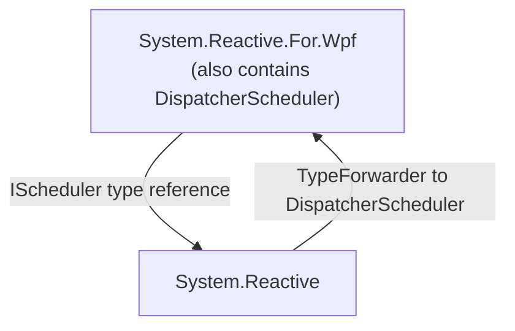
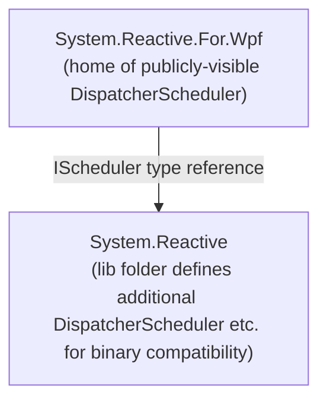
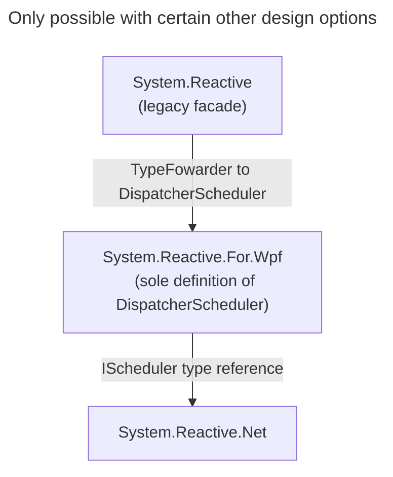

# Splitting `System.Reactive` into `System.Reactive.Net` and UI framework support packages

When a .NET project that targets Windows takes a dependency on `System.Reactive`, there are circumstances in which this causes unwanted dependencies on the WPF and Windows Forms frameworks. This can add many tens of megabytes to the deployable size of applications. This document describes how Rx 7.0 fixes this problem.


## Status

Proposed


## Authors

@idg10 ([Ian Griffiths](https://endjin.com/who-we-are/our-people/ian-griffiths/)).


## In brief

This is an extremely long document, because there is a lot of context. The primary purpose of this ADR is to fully describe all of the context, and to enable us to properly evaluate the design choice in the light of all relevant information. That makes it very long. If you aren't doing one of the following:

* proposing a solution
* reviewing a proposed solution
* implementing a solution
* trying (at some point in the future) to understand past design decisions

then this will be far more detail than is necessary.

If you want to understand the problem, the preferred solution, and its consequences, you do not need to read everything. It is sufficient to read the following:

* the [Overview](#overview) section
* the [preferred design option](#option-6-ui-framework-specific-packages-deprecating-the-systemreactive-versions)
* the [Decision](#decision) section
* the [Consequences](#consequences) section


## Overview

This table shows the output sizes for a simple console app ,  targeting `net8.0-windows10.0.19041`, with various deployment models. (The problem this ADR addresses only afflicts applications with a Windows-specific TFM, and only those specifying a version of `10.0.19041` or later.) The console app calls some WinRT APIs, hence the need for the `-windows` TFM, but does not use any UI framework. The final column shows the impact of adding a reference to Rx (`System.Reactive` v6.0.1) and a single line of code using Rx.

| Deployment type | Size without Rx | Size with Rx |
|--|--|--|
| Framework-dependent | 20.8MB | 22.5MB |
| Self-contained | 90.8MB | **182MB** |
| Self-contained trimmed | 18.3MB | 65.7MB |
| Native AOT | 5.9MB | 17.4MB |

The worst case, self-contained deployment, is widely used by applications that need a `-windows` TFM. It roughly doubles the size of this application, adding over 90MB! With trimming, the absolute impact is smaller (Rx adds 47.4MB) but the relative increase is even larger, at a factor of 3.6.

The basic problem is that for applications with a Windows-specific TFM, `System.Reactive` imposes dependencies on WPF and Windows Forms. (To be precise, it causes a dependency on the `Microsoft.Desktop.App` framework, which is .NET's deployment vehicle for both WPF and Windows Forms.) Complete copies of these frameworks get included in self-contained deployments, and trimming has only a small effect on the impact.

This issue has caused some projects to abandon Rx entirely.

After [Avalonia ran into this problem](https://github.com/AvaloniaUI/Avalonia/issues/9549), they [ removed all use of Rx.NET](https://github.com/AvaloniaUI/Avalonia/pull/9749) in January 2023. In the discussion of [#1461](https://github.com/dotnet/reactive/issues/1461) you'll see some people talking about not being able to use Rx because of this problem.

Since then, a [workaround](#the-workaround) has been discovered. Unfortunately, although this mitigates the problem to some extent, the workaround has shortcomings, meaning it can't be used in all scenarios. It happens to work for the particular example I'm using to create these tables, so we can see that when it works, it reduces the output sizes considerably:

| Deployment type | Size without Rx | Size with Rx using workaround |
|--|--|--|
| Framework-dependent | 20.8MB | 22.5MB |
| Self-contained | 90.8MB | **92MB** |
| Self-contained trimmed | 18.3MB | 18.3MB |
| Native AOT | 5.9MB | 6.2MB |

For the four deployment models shown, the workaround reduces the impact of adding Rx to 1.6MB, 1.6MB, unmeasureably small, and 300KB respectively.

The view of the Rx .NET maintainers is that projects using Rx should not be forced into a situation where their deployments become unreasonably large. There are a lot of subtleties and technical complexity here, but the bottom line is that we want Rx to be an attractive choice. We believe Rx is especially useful in desktop applications, and since self-contained deployment is popular in those scenarios, Rx.NET needs to work well with self-contained deployment with Windows-specific TFMs.

It has taken a while to decide on a solution. We wanted to find a way of fixing this that would minimize the changes to how Rx.NET is packaged. There has already been enough confusion caused in the past by changes in NuGet packaging, and the complexity arising from having Rx.NET split into multiple components. The apparent discovery of a [workaround](#the-workaround) led to hope that this would be possible, although this discovery came fairly late in the day, some time after various projects had decided to stop using Rx.NET. That is important context for understanding earlier discussion of this topic. Back when [endjin](https://endjin.com) took over maintenance and development of Rx .NET at the start of 2023, it was believed that there was no workaround, so our plan was that Rx 7.0 would need to address this problem with radical changes (e.g., introducing a new 'main' Rx package, with `System.Reactive` being the sad casualty of an unfortunate technical decision made half a decade ago). Then when a workaround was apparently identified, we thought that the pressure to make changes quickly had been removed. It seemed that Rx 6.0 could be used in a way that didn't encounter these problems. So we formulated a plan for a less radical, more gradual longer-term plan. We were going to deprecate the parts of the library that caused this problem and introduce replacements in other components, with a long term plan of eventually removing them from `System.Reactive`, at which point the workaround would no longer be required. 

Unfortunately, some time later it became apparent that the workaround's limitations were too severe. This seemed to put us back at square one: the more radical approach looked inevitable. However, after some further experimentation, we hit upon a new approach:

1. `System.Reactive` remains as the main Rx package
2. `System.Reactive` no longer forces a dependency on the `Microsoft.Desktop.App`
3. UI-specific code remains in the `System.Reactive` runtime packages but is no longer visible to the compiler (because the package now includes reference assemblies that omit these types and methods)
4. Apps and libraries wishing to continue to use UI-framework-specific Rx features directly do so via new UI-framework-specific packages (so they need a new package reference, but no source code changes)
5. Binary compatibility is maintained for any apps and libraries that were built against older versions of `System.Reactive`

(3. is the unusual part of this. It's what enables us to do 2, for reasons explained later.)

Anyone who is using `System.Reactive` v6 in code that des _not_ target a Windows-specific TFM will not need to change anything when upgrading to v7. Nor will anyone who is using `System.Reactive` but without using any UI-framework-specific features.

This does impose some disruption on developers who are using the UI-framework-specific features today. They will need to add a new package reference for each UI framework in question.

This document explains the [origin of the problem](#the-road-to-the-current-problem), the proposed [workaround](#the-workaround) and its shortcomings, [the community feedback we've received](#community-input), and the [constraints that any solution will have to satisfy](#constraints). It then describes [the changes in Rx .NET 7.0 that fix this](#decision).


## Context

To decide on a good solution, we need to take a lot of information into account. It is first necessary to characterise [the problem](#the-problem) clearly. It is also necessary to understand [the history that led up to the problem](#the-road-to-the-current-problem), because this illustrates the [constraints that any solution must fulfil](#constraints). Also, we describe the [workaround](#the-workaround) to make it clear why ultimately we couldn't use it.

We [started a public discussion](https://github.com/dotnet/reactive/discussions/2038) of this problem, and have received a great deal of [useful input from the Rx.NET community](#community-input). There are [several ways we could try to solve this](#the-design-options), and they must each be evaluated in the light of all the other information.

The following sections address all of this before moving onto the [decision](#decision).

### The problem

The basic problem is described at the start of this document, but we can characterise it more precisely:

> An application that references the [`System.Reactive` NuGet package](https://www.nuget.org/packages/System.Reactive) (directly or transitively) and which has a Windows-specific target specifying a version of `10.0.19041` or later will acquire a dependency on the [.NET Windows Desktop Runtime](https://github.com/dotnet/windowsdesktop) (sometimes referred to as just the ".NET Desktop Runtime" and also sometimes referred to by the technical _shared framework name_ `Microsoft.WindowsDesktop.App`).
>
> This occurs because the `System.Reactive` package's `nuspec` file's `frameworkReferences` section states that this package's `net6.0-windows10.0.19041` target has a `frameworkReference` to `Microsoft.WindowsDesktop.App`. Here's the relevant section of the `nuspec` file in `System.Reactive` 6.0.1:
>
> ```xml
>  <frameworkReferences>
>    <group targetFramework="net6.0" />
>    <group targetFramework="net6.0-windows10.0.19041">
>      <frameworkReference name="Microsoft.WindowsDesktop.App" />
>    </group>
>    <group targetFramework=".NETFramework4.7.2" />
>    <group targetFramework=".NETStandard2.0" />
>    <group targetFramework="UAP10.0.18362" />
>  </frameworkReferences>
>  ```
>
> Framework references are transitive, which is why it's not just direct references to `System.Reactive` that cause this issue.
>
> An unwanted dependency on the .NET Windows Desktop Runtime causes a problem for self-contained deployment (and, by extension, Native AOT) because it means those deployments end up including complete copies of the Windows Forms and WPF frameworks. This can add many tens of megabytes to the application in its final deployable form. Trimming mitigates this but there is still a large increase in size. This is especially frustrating for applications that use neither WPF nor Windows Forms.

That "or transitively" in the first parenthetical is easily overlooked, but is very important. Some developers have found themselves encountering this problem not because their applications use `System.Reactive` directly, but because they are using some library that depends on it. Many simple and initially plausible-looking solutions proposed to the problem this ADR addresses founder in cases where an application acquires a dependency to Rx.NET transitively, especially when it does so through multiple different references that ask for different versions.

### A note on Target Framework Monikers

In .NET, components and applications indicate the environments they can run on with Target Framework Monikers (TFMs). These are often misunderstood. The problem this ADR describes can partly be blamed on a misuse of TFMs.

TFMs can be very broad. A component with a TFM of `netstandard2.0` can run on any .NET runtime that supports .NET Standard 2.0 (e.g., .NET 8.0, or .NET Framework 4.7.2), and does not care which operating system it runs on. But TFMs can be a good deal more specific. If a component has a TFM of `net6.0-windows10.0.19041`, it requires .NET 6.0 or later (so it won't run on any version of .NET Framework) and will run only on Windows. Moreover, it has indicated that it was built for a particular Windows API surface area. That `10.0.19041` is an SDK version number and it corresponds to the May 2020 update to Windows 10 (also known as version 2004, or 20H1).

A version-specific TFM does not necessarily imply a minimum OS version requirement. A component must specify 10.0.19041 if it wants to attempt to use APIs introduced in that version of Windows, but the operative word here is "attempt". It's possible to detect failures and fall back to alternative behaviour when the API turns out to be unavailable. Thus, a component with a `net6.0-windows10.0.19041` TFM may well be able to run on Windows 10.0.18362.

All OS-specific TFMs are also version-specific. If you don't specify the version, the .NET SDK picks one for you. For example, in all .NET SDKs published to date since 5.0 (the latest being 9.0.304 at the time of writing this), `net6.0-windows` is equivalent to `net6.0-windows7`.

Although the OS version part of a TFM does not imply a minimum requirement, the .NET version number does. `net472` components can't run on .NET Framework 4.6. `net6.0` components can't run on `net5.0`.

The final popularly misunderstood feature of TFMs is that when a .NET version goes out of support, its corresponding TFM remains supported. Often when people see a library with a TFM of, say, `net5.0`, they think the library is defunct because .NET 5.0 went out of support a long time ago. That's not necessarily true, because .NET 9.0, the latest version of .NET as I write this, supports running components with a TFM of `net5.0`. In fact it supports TFMs all the way back to `netcoreapp1.0`!

### The road to the current problem

The problem this ADR addresses arose from a series of changes made over half a decade ago that were intended to solve other problems. We need to ensure that we don't reintroduce any of these older problems, so it's important to have a good understanding of the following factors that led to the current design:

1. the long history of confusion in Rx's package structure
2. the subtle problems that could occur when plug-ins use Rx
3. the initial attempt to solve the plug-in problem, and the new problems this created
4. the [_great unification_](https://github.com/dotnet/reactive/issues/199) in Rx 4.0 that solved the problems caused by the initial attempt to fix the plug-in problem, and which, ironically, sowed the seeds for the re-emergence of the plug-in problems in a later version
5. changes in .NET Core 3.0 which, in combination with the _great unification_, caused the problem that this ADR aims to solve
6. the regression that re-introduced the plug-in problem in Rx 5.0, and why it might not matter as much as it used to

#### Rx's history of confusing packaging

The first public previews of Rx appeared back in 2009 before NuGet was a thing. This meant Rx was initially distributed in the old-fashioned way: you installed an SDK on development machines that made Rx's assemblies available for local development, and had to arrange to copy the necessary redistributable files onto target machines as part of your application's installation or deployment process. By the time [the first supported Rx release shipped in June 2011](https://web.archive.org/web/20110810091849/http://www.microsoft.com/download/en/details.aspx?id=26649), NuGet did exist, but it was early days, so for quite a while Rx had [two official distribution channels: NuGet and an installable SDK](https://cc.bingj.com/cache.aspx?q=microsoft+download+reactive+extension+sdk&d=5018270206749605&mkt=en-GB&setlang=en-GB&w=LCqKaZy3VgjqC_Zlig1e4qmTo82s8qt5).

There were several different versions of .NET around at this time besides the .NET Framework. (This was a long time before .NET Core, by the way.) Silverlight and Windows Phone both had their own runtimes, and the latter had a version of Rx preinstalled as part of the OS. Windows 8 had its own version of .NET that worked quite differently from anything else. (This is why you will occasionally see `netcore45` or `netcore451` TFMs despite the fact that .NET Core skipped from v3.1 straight to .NET 5.0. It's also why the first few .NET Core TFMs all have `app` in their names, e.g. `netcoreapp1.0`. By this time, `netcore` meant the Windows 8 store app version of .NET, so they had to use a different name.) These all had very different subsets of the .NET runtime class libraries, especially when it came to threading support. Rx was slightly different on each of these platforms because attempting to target the lowest common denominator would have meant sub-optimal performance everywhere. There were two main ways in which each of the different Rx versions varied:

* The scheduler support was specialized to work as well as possible on each distinct target
* Each platform had a different UI framework (or frameworks) available, so Rx's UI framework integration was different for each target

Some of the differences in the first category were implementation details behind an API common to all versions, but there were some public API differences too. (You can still see an echo of this in Rx 6.0. The `ThreadPoolScheduler` class is available on all platforms, but on UWP, which is effectively the successor to the old Windows 8 API, this class has two extra properties, `Priority` and `Options`, for controlling UWP-specific thread pool behaviour.) The second category necessarily involves differences in the public API, although at this point in Rx's history, all of its UI-framework-specific code was in separate assemblies, so those differences were isolated. There was a common core to Rx's public API that was the same across all platforms.

This meant that it would be possible, in principle, to write a library that depended on Rx, and which could be used on all the same platforms that Rx supported. However, it wasn't entirely straightforward to do this back in 2011.

This was years before .NET Standard was introduced, and at the time, if you wanted to write cross-platform libraries, you had to create something called a Portable Class Library (PCL). Rx wanted to offer a common API across all platforms while also providing optimized platform-specific schedulers, so it introduced a platform abstraction layer and a system it called "enlightenments" (named after a similar feature in Virtual Machine architectures). This worked, but resulted in a somewhat confusing proliferation of DLLs.

An additional dimension to the confusion is that even within any single target platform, Rx was split across several different components, and it wasn't entirely obvious why. There was a separate `System.Reactive.Interfaces` component defining the core interfaces Rx defines that aren't in the runtime libraries such as `IScheduler` and `ISubject<T>`. The original idea was that this would be a stable component that didn't need frequent releases, because the core Rx interfaces would change very rarely. That expectation was proven correct over time, but unfortunately, the rationale behind the packaging decision was apparently forgotten, because instead of `System.Reactive.Interfaces` v2.0.0 being the one true definition for all time, new versions of this component were produced with each new version of Rx even when nothing changed. This defeated the entire purpose of having a separate component for the core interfaces.

(In fact things were a little weirder because some of the versions of .NET supported by Rx 1.0 defined the core `IObservable<T>` and `IObserver<T>` interfaces in the runtime class libraries but some did not. These interfaces were not present in .NET 3.5, for example, which Rx 1.0 supported. So Rx had to bring its own definition of these for some platforms. You might expect these to live in `System.Reactive.Interfaces` but they did not, because Microsoft wanted that package to be the same on all platforms. So on platforms where `IObservable<T>` and `IObserver<T>` were not built in, there was yet another DLL in the mix, further adding to the confusion around exactly what assemblies you needed to ship with your app if you wanted to use Rx.)

The other splits were also hard to comprehend—it's not obvious why the LINQ parts of Rx are in their own package. In practice, anyone using Rx is going to use its LINQ features. The role of the 'providers' component that existed in these early days is also not obvious.

The 'platform services' part is arguably slightly easier to understand because .NET developers at this time were generally aware that there were lots of flavours of .NET each with slightly different characteristics. Even then, understanding how that worked in practice was tricky, and this was just another bit of complexity that could make Rx harder to use.

In summary, you couldn't simply add a reference and start using Rx. Understanding which components your applications or libraries should reference in order to use Rx, and understanding which particular DLLs needed to be deployed was not easy, and presented a barrier to adoption for new users.

The NuGet distribution of Rx introduced a simplifying concept in v2.2: Rx was still fragmented across multiple components at this point, but the simplifying move was to define NuGet metapackages enabling you to use just a single package reference for basic Rx usage. For example, a single reference to [`Rx-Main` v2.2.0](https://www.nuget.org/packages/Rx-Main/2.2.0) would give you everything you needed to use Rx. There were additional metapackages appropriate for using specific UI frameworks with Rx. For the first time, now you could just add one reference and immediately start using Rx.

Because Rx has always supported many different runtimes, each Rx.NET NuGet package contains several different builds of its component. For quite a long time, there were different copies of Rx for different versions of .NET Framework. For example, Rx 2.2.0 had one targeting .NET Framework 4.0, and another targeting .NET Framework 4.5. NuGet can cope with this—you just end up with `net40` and `net45` subfolders under `lib`. The .NET SDK works out at build time which one to use based on the runtime your application targets.

So there were effectively two dimensions of fragmentation. First, behind each metapackage there were multiple NuGet packages. (Rx 2.2's [`Rx-Main` metapackage](https://www.nuget.org/packages/Rx-Main/2.2.0#dependencies-body-tab) depends on [`Rx-Core`](https://www.nuget.org/packages/Rx-Core/2.2.0), [`Rx-Interfaces`](https://www.nuget.org/packages/Rx-Interfaces/2.2.0), [`Rx-Linq`](https://www.nuget.org/packages/Rx-Linq/2.2.0) and [`Rx-PlatformServices`](https://www.nuget.org/packages/Rx-PlatformServices/2.2.0), for example. And just to add to the confusion, the package names aren't the same as the names of the assemblies they contain. These four packages provide `System.Reactive.Core.dll`, `System.Reactive.Interfaces.dll`, `System.Reactive.Linq.dll`, and `System.Reactive.PlatformServices.dll` respectively.) And then each of those packages contained multiple versions of what was, conceptually speaking, the same assembly (but with various technical differences due to differences between the target platforms). For example, if you [look inside `Rx-Core` 2.2.0](https://nuget.info/packages/Rx-Core/2.2.0) you'll see its `lib` folder contains 8 folders, each of which contains a slightly different build of `System.Reactive.Core.dll`.


It's the same story for [`Rx-Interfaces`](https://nuget.info/packages/Rx-Interfaces/2.2.0) and [`Rx-Linq`](https://nuget.info/packages/Rx-Linq/2.2.0). And it's almost the same for [`Rx-PlatformServices`](https://nuget.info/packages/Rx-PlatformServices/2.2.0) except for some reason that doesn't have a `portable-windows8+net45+wp8` folder.

Each of these subfolders of each NuGet package's `lib` folder contains the assembly for that package, built in a way tailored for that particular target. So `Rx-Core` contains 8 copies of `System.Reactive.Core.dll`, `Rx-Interfaces` contains 8 copies of `System.Reactive.Interfaces.dll`, `Rx-Linq` contains 8 copies of `System.Reactive.Linq.dll`, and `Rx-Core` contains 7 copies of `System.Reactive.PlatformServices.dll`. So conceptually we've got 4 assemblies here, but because of all the different builds, there are actually 31 files!

#### Plug-in problems

This fragmentation caused [a problem with plug-in systems (#97)](https://github.com/dotnet/reactive/issues/97). People often ran into this when writing extensions for Visual Studio. Visual Studio was a common place to have these problems simply because a lot of people wrote extensions for it, and it was common for a single user to use a lot of plug-ins, but any .NET Framework based application with a plug-in based extensibility mechanism could have the same problems.

If one plug-in was written to use Rx.NET 2.2.0 and if that plug-in was compiled for .NET Framework 4.0, deploying that plug-in would entail providing a copy of the assemblies from the `net40` folder of each of the four packages referenced by `Rx-Main`. If another plug-in was also written to use the same version of Rx.NET but was compiled for .NET Framework 4.5, its deployment files would include the DLLs from the `net45` folders of each of these packages.

Visual Studio is capable of loading components compiled for older versions of .NET Framework, so a version of Visual Studio running on .NET Framework 4.5 would happily load either of these plug-ins. But if it ended up loading both, that would mean that each plug-in was trying to supply its own set of Rx DLLs. That caused a problem.

Here's what would happen. Let's say we have two plug-ins, `PlugInOneBuiltFor40` and `PlugInTwoBuiltFor45`. Both were built with a reference to `Rx-Main` 2.2.0. That means that if we were to look at how these plug-ins looked on disk once they had been installed in the target application, we'd see something like this:

* `PlugInInstallationFolder`
  * `PlugInOneBuiltFor40`
    * `PlugInOneBuiltFor40.dll`
    * `System.Reactive.Core.dll` v2.2.0 (`net40` build)
    * `System.Reactive.Interfaces.dll` v2.2.0 (`net40` build)
    * `System.Reactive.Linq.dll` v2.2.0 (`net40` build)
    * `System.Reactive.PlatformServices.dll` v2.2.0 (`net40` build)
  * `PlugInTwoBuiltFor45`
    * `PlugInTwoBuiltFor45.dll`
    * `System.Reactive.Core.dll` v2.2.0 (`net45` build)
    * `System.Reactive.Interfaces.dll` v2.2.0 (`net45` build)
    * `System.Reactive.Linq.dll` v2.2.0 (`net45` build)
    * `System.Reactive.PlatformServices.dll` v2.2.0 (`net45` build)

(Visual Studio uses a more complex folder layout in reality, but that's not significant. _Any_ plug-in host will have the same issue.)

The critical thing to notice here is that for each of the four Rx assemblies, we have two copies, one built for .NET 4.0 and one built for .NET 4.5. Crucially, _they have the same version number_. In all cases they come from a NuGet package with version 2.2.0. But for the problems I'm describing, what matters more is the .NET assembly version numbers. (.NET versioning is a separate mechanism from NuGet versioning. There's no rule requiring these two version numbers to be related in any way, although by convention they often are, and they are for Rx 2.2.0.) The assembly version numbers are all 2.2.0.0. (.NET assemblies have 4 parts, one more than NuGet packages. But in Rx 2.2.0, the 4th part of the .NET assembly version was always set to 0.) The vital thing to understand here is that for any Rx component, e.g. `System.Reactive.Core.dll`, we have two _different_ copies (a .NET 4.0 and a .NET 4.5 one) but they have _exactly the same name in .NET_.

Let's see why that causes a problem. Suppose Visual Studio happens to load `PlugInOneBuiltFor40` first. That will be able to use its copies of the Rx assemblies. But when the second plug-in, `PlugInTwoBuiltFor45`, first attempts to use `System.Reactive.Core`, the .NET assembly resolver would notice that it has already loaded an assembly named `System.Reactive.Core` with version number 2.2.0.0, the exact version `PlugInTwoBuiltFor45` is asking for. In the scenario I'm describing, this already-loaded copy will be the `net40` version, but the assembly resolver doesn't know that it's different from what `PlugInTwoBuildFor45` wants.

The .NET Framework assembly resolver assumes that the full name (the combination of simple name, version, public key token, and culture) uniquely identifies an assembly. But Rx 2.2.0 supplies multiple different assemblies that have exactly the same full name, so it fails to comply with that basic assumption, meaning that the assembly resolver doesn't do what we want. It doesn't even bother to look at the copy of `System.Reactive.Core` in the `PlugInTwoBuiltFor45` folder, because it already has an assembly with the right name in memory. The second component ends up using the `net40` version, and not the `net45` version it shipped. As it happens, these have the same public API surface area, so in this particular case we wouldn't get `TypeLoadException` or `MissingMethodException` failures. But there is a behavioural difference. It's quite an obscure one, relating to whether an [`OperationCanceledException`](https://learn.microsoft.com/en-us/dotnet/api/system.operationcanceledexception) reports the correct [`CancellationToken`](https://learn.microsoft.com/en-us/dotnet/api/system.operationcanceledexception.cancellationtoken) when you use Rx's `ToTask` or `ForEachAsync`. (As far as I can tell, this is the only respect in which the `net40` and `net45` versions of Rx were different at that time.) If `PlugInTwoBuiltFor45` depended on the correct behavior here, that would be a problem because it would end up using the `net40` version, and it was not possible to implement this correctly on .NET Framework 4.0.

Although this was an extremely specific problem, the bigger problem was that if future versions of Rx ended up with greater divergences on different .NET Framework versions, plug-ins wanting newer versions could well end up encountering `TypeLoadException` or `MissingMethodException` failures as a result of not getting the version they require.

This afflicts plug-in systems only because those defeat an assumption that is normally valid. Normally we can assume that for any single application, the build process for that application will have an opportunity to look at all of the components that make up the application, including all transitive dependencies, and to detect situations like this. In some cases, it might be possible to use rules to resolve it automatically. (You might have a rule saying that when a .NET 4.5 application uses a .NET 4.0 component, that component can be given the .NET 4.5 version of one of its dependencies. In this case it would mean both `PlugInOneBuiltFor40` and `PlugInTwoBuiltFor45` would end up using the `net45` build of the Rx components. And that would work just fine, assuming `PlugInOneBuiltFor40` didn't actually depend on the slightly deficient `CancellationToken` handling in the `net40` build.) Or it might detect and report a conflict that cannot be safely resolved automatically requiring the developer to resolve the situation explicitly. But the problem with plug-in systems is that the exact set of .NET components in use does not become apparent until runtime, and will change each time you add a new plug-in. It's not possible to know what the entire application looks like when you build the application because the whole point of a plug-in system is that it makes it possible to add new components to the application long after the application has shipped.

It's worth noting at this point that the problem I've just described doesn't need to affect applications using .NET (as opposed to .NET Framework). Back when the thing we now call ".NET" was still called .NET Core, .NET Core added the [`AssemblyLoadContext` type](https://learn.microsoft.com/en-us/dotnet/core/dependency-loading/understanding-assemblyloadcontext) which makes it possible for different plug-ins each to load their own copies of assemblies, even when they have exactly the same full name as assemblies loaded by other plug-ins. But that feature didn't exist back in the Rx 2.0 or 3.0 days (and still doesn't exist in .NET Framework even today).

[Rx 3.1](https://github.com/dotnet/reactive/releases/tag/v3.1.0) attempted to solve the plug-in problem by using [slightly different version numbers for the same 'logical' component on each supported target](https://github.com/dotnet/reactive/pull/212). You might have expected this to use the fourth part that .NET assembly versions have, with the first 3 matching the 3 parts that NuGet packages have, but in fact they chose to use the 3rd part, leaving the 4th part as 0. You can see the [code that sets the version number differently based on the target in GitHub](https://github.com/dotnet/reactive/blob/e0b6af3e204feb8aa13841a8a873d78ae6c43467/Rx.NET/Source/GlobalAssemblyVersion.cs) but I've reproduced it here:

```cs
#if NETSTANDARD1_0 || WP8
[assembly: AssemblyVersion("3.0.0.0")]
#elif NETSTANDARD1_1 || WINDOWS8 || NET45 || NETCORE45
[assembly: AssemblyVersion("3.0.1000.0")]
#elif NETSTANDARD1_2 || WINDOWS81 || NET451 || NETCORE451 || WPA81
[assembly: AssemblyVersion("3.0.2000.0")]
#elif NETSTANDARD1_3 || NET46
[assembly: AssemblyVersion("3.0.3000.0")]
#elif NETSTANDARD1_4 || UAP10_0 || NETCORE50 || NET461
[assembly: AssemblyVersion("3.0.4000.0")]
#elif NETSTANDARD1_5 || NET462
[assembly: AssemblyVersion("3.0.5000.0")]
#elif NETSTANDARD1_6 || NETCOREAPP1_0 || NET463
[assembly: AssemblyVersion("3.0.6000.0")]
#else // this is here to prevent the build system from complaining. It should never be hit
[assembly: AssemblyVersion("invalid")]
#endif
```

By this time Rx.NET was no longer building .NET 4.0 versions, but it did offer `net45`, `net451`, `net462`, and `net463` versions. So in a suitably updated version of the plug-in scenario described above, imagine we have `PlugInTwoBuiltFor45` and `PlugInThreeBuiltfor46` both using Rx v3.1.1. `PlugInTwoBuiltFor45` would be using versions of the Rx components with a .NET assembly version of `3.0.1000.0`, while `PlugInThreeBuiltfor46` would be using version `3.0.3000.0`. The .NET Framework assembly resolver would consider these to be distinct assemblies because they have different full names, so it would happily load both versions simultaneously, avoiding the problem.

This change predates .NET Core/modern .NET, and that newer lineage of runtimes has a different approach to assembly versioning: whereas .NET Framework requires a strict version match, .NET Core and its successors (e.g. .NET 6.0, .NET 8.0) consider any assembly with a version number greater than or equal to the requested version to be a match. A basic assumption of this Rx 3.0 versioning tactic—that the assembly resolver wants an exact match on the version—is no longer true on all versions of .NET. (A common theme of the problems described in this ADR is that many decisions were based on assumptions that were valid at the time but no longer are.) Fortunately, it typically doesn't matter for plug-in scenarios because the `AssemblyLoadContext` side-steps this whole issue on the newer runtimes that have this different versioning behavior.

Unfortunately, Rx 3.1's change in version numbering went on to cause various new issues. There's [a partial list of these issues in a comment in issue 199](https://github.com/dotnet/reactive/issues/199#issuecomment-266138120), and if you look through [#205](https://github.com/dotnet/reactive/issues/205) you'll see a few links to other problems. Even at the time this change was proposed, it was [acknowledged that there was a potential problem with binding redirects](https://github.com/dotnet/reactive/issues/205#issuecomment-228577028). Binding redirects often specify version ranges, which means if you upgrade 3.x to 4.x, it's possible that 3.0.2000.0 would get upgraded to 4.0.1000.0, which could actually mean a downgrade in API surface area (because the x.x.2000.0 versions might have target-specific functionality that the x.x.1000.0 versions do not).

As has happened quite a lot in the history of this problem, something that worked fine in a simple set up turned out to have issues when dependency trees got more complex. Applications (or plug-ins) using Rx directly had no problems, but if you were using multiple components that depended on Rx, and if those components had support for different mixtures of targets, you could hit problems.

For example, if your application targetted .NET 4.6.2, and you were using two libraries that both depend on Rx 3.1.1, but one of those libraries offers only a `net45` target and the other offers only a `net461` target, they now disagree on the version of Rx they want. The first wants Rx components with version numbers of `3.0.1000.0`, while the second wants components with version numbers of `3.0.4000.0`. This could result in assembly version conflict reports when building the application. You might be able to solve this with assembly binding redirects, and you might even be able to get the build tools to generate those for you. But there were scenarios where the tooling couldn't work out what to do, and developers were left trying to understand all of the history I've described so far in order to work out how to unpick the mess. (It didn't help that the history had not, at that point, been written down in a single document, so it was quite hard even to work out what the history was.) And this also relies on the same "we can resolve it all when we build the application" assumption that is undermined in plug-in scenarios, so this could _still_ cause problems for plug-ins!

The basic problem here is that when building any single deployable target (either an application or a plug-in) you might be using a mixture of components that target several different runtimes. These might be a mutually compatible combination (e.g., if you use components targeting `net40`, `net45`, and `net46`, they can all run happily on .NET 4.6.2) but if any of them used Rx 3.1.1, you might now have a problem because they could each want a different one of the various versions of the assemblies available in Rx 3.1.1's NuGet packages.

#### Rx 4.0's great unification

[Rx 4.0](https://github.com/dotnet/reactive/releases/tag/rxnet-v4.0.0) tried a different approach: have just one Rx package, `System.Reactive`, which has no dependencies. This removed all of the confusion that had been caused by Rx previously being split into four pieces.

Rx 4.0 was able to sidestep the plug-in problem because by now, there was no need to ship separate Rx builds for multiple versions of .NET Framework. That had been necessary on older versions because different .NET Framework releases had different capabilities relating to the thread pool or other task-related features, meaning that a version of Rx that worked on .NET Framework 4.0 would be suboptimal on .NET Framework 4.5. But by the time Rx 4.0 came out (May 2018) Microsoft had already ended support for .NET Framework 4.0, so Rx didn't need to support it. In fact, the oldest version of .NET Framework that it made sense to target at this point was 4.6, and it turns out that none of the new features added in subsequent versions of .NET Framework were of particular use to Rx.NET, so there was no longer any value in building multiple versions of Rx.NET targeting different versions of .NET Framework.

This was a critical change in the landscape, because it created an opportunity for Rx.NET.

Since there was now just a single .NET Framework target (`net46`), the original plug-in problems could no longer occur. (The only reason they happened in the first place was that Rx used to offer different assemblies targeting different versions of .NET Framework.) Furthermore, collapsing Rx down to a single assembly, `System.Reactive`, solved all of the newer problems created by the Rx 3.1 era attempt to solve the plug-in problems by playing games with .NET assembly version numbers.

This simplification was ingenious, and it worked brilliantly. Until it didn't. But we'll get to that.

Although it now targeted just one version of .NET Framework, `System.Reactive` was still a multi-target NuGet package. If you download the v4.0 package and unzip it (`.nupkg` files are just ZIP files) you will find the `lib` folder contains subfolders for 5 different TFMs:

* `net46` (.NET Framework 4.0)
* `netstandard2.0`
* `uap10` (UWP)
* `uap10.0.18362` (UWP)

Each contains a `System.Reactive.dll` file, and each is slightly different. The `netstandard2.0` one is effectively a lowest common denominator, and it is missing some types you will find in the more specialized versions. For example, the version in `net46` includes `ControlScheduler`, a type that provides integration between Rx and the Windows Forms desktop client framework. Windows Forms is built into .NET Framework—it's not possible to install .NET Framework without Windows Forms—and so it's possible for the `net46` version of Rx to include that type. But `netstandard2.0` does not include Windows Forms—that version of Rx may find itself running on Linux, where Windows Forms definitely won't be available. Consequently, the `System.Reactive.dll` in the package's `netstandard2.0` folder does not include the `ControlScheduler`.

This illustrates that with this _great unification_, when you add a reference to `System.Reactive`, you get everything NuGet has to offer on whatever platform your application targets. So if you're using .NET Framework, you get Rx's WPF and Windows Forms features because WPF and Windows Forms are built into .NET Framework. If you're writing a UWP application and you add a reference to `System.Reactive`, you get the UWP features of Rx.

That sounds very convenient, but it turned out to be a simplification too far.

#### Problems arising from the great unification

The _great unification_ worked fine until .NET Core 3.0 came out. That threw a spanner in the works, because it undermined a basic assumption that the _great unification_ made: the assumption that your target runtime would determine what UI application frameworks were available. Before .NET Core 3.0, the availability of a UI framework was determined entirely by which runtime you were using. If you were on .NET Framework, both WPF and Windows Forms would be available, and if you were running on any other .NET runtime, they would be unavailable. If you were running on the oddball version of .NET available on UWP (which, confusingly, is associated with TFMs starting with `uap`, and even more confusingly, is also associated with the `netcore50` TFM, a TFM that is completely _unrelated_ to .NET 5.0) the only UI framework available would be the UWP one, and that wasn't available on any other runtime.

But .NET Core 3.0 ended that simple relationship. Consider this table:

| Framework | Which client-side UI Frameworks are available? |
|--|--|
| .NET Framework (`net462`, `net48` etc.) | Windows Forms and WPF |
| UWP (`uap10.0` etc.) | UWP |
| .NET Core before 3.0 (e.g. `netcoreapp2.1`) | None |
| .NET Core 3.0 and later .NET (`netcoreapp3.0`, `net6.0`, `net8.0` etc.) | **It depends...** |

.NET Core 3.0 broke the assumption that your choice of target framework would fully determine which client-side UI frameworks were available.

Why is it a problem? Well, what UI framework integration should Rx offer in its various targets? This table attempts to answer that question for all of the targets that [Rx 4.2](https://github.com/dotnet/reactive/releases/tag/rxnet-v4.2.0) (the version that added [.NET Core 3.0 support](https://github.com/dotnet/reactive/pull/857)) supported:

| TFM | Which UI framework should Rx support? | What does it actually support? |
|--|--|--|
| `net46` | Windows Forms and WPF | Windows Forms and WPF |
| `uap10.0` | UWP | UWP |
| `uap10.0.18362` | UWP | UWP |
| `netstandard2.0` | None | None |
| `netcoreapp3.0`| **None, probably** (see below) | **Windows Forms and WPF (!)** |

Why have I put "None" in the middle column of the `netcoreapp3.0` row, bearing in mind that .NET .NET Core 3.0 added WPF and Windows Forms support? Well these UI frameworks are only available on Windows. The `netcoreapp3.0` TFM is OS-agnostic. With this target you could find yourself running on macOS or Linux. The Windows-specific underpinnings won't necessarily be there, and that's why I believe the correct answer for that row is "None".

As part of Rx.NET's [preparation for .NET 5 support](https://github.com/dotnet/reactive/pull/1291), a `net5.0` target was added. This did **not** include Windows Forms and WPF features. That is unarguably correct, because if you were to create a new project targeting `net5.0` and set either `UseWPF` or `UseWindowsForms` (or both) to `true` you'd get a build error telling you that you can only do that when the target platform is Windows. It recommends that you use an OS-specific TFM, such as `net5.0-windows`.

Why is it like this for .NET 5.0, but not .NET Core 3.0? It's because [the way TFMs work changed in .NET 5.0](https://github.com/dotnet/designs/blob/main/accepted/2020/net5/net5.md). OS-specific TFMs did not exist before .NET 5.0. So with .NET 5.0 and later, we can append `-windows` to indicate that we need to run on Windows. Since there was no way to do that before, `netcoreapp3.0` doesn't tell you anything about what the target OS needs to be.

My view is that since the `netcoreapp3.0` TFM doesn't enable you to know whether Windows Forms and WPF will necessarily be available, that it would be better not to ship a component with this TFM that requires that it will be available (unless that component is specifically designed to be used _only_ in environments where these frameworks will be available). That's why I put "None" in the 2nd column for that row. However, it seems like when Rx team added .NET Core 3.0 support, they chose a maximalist interpretation of their concept that a reference to `System.Reactive` means that you get access to all Rx functionality that is applicable to your target. Since running on .NET Core 3.0 _might_ mean that Windows Forms and WPF are available, Rx decides it _will_ include its support for that.

I don't know what happens if you use Rx 4.2 on .NET Core 3.0 in an environment where you don't in fact have Windows Forms or WPF. (There are two reasons that could happen. First, you might not be running on Windows. Second, more subtly, you might be running on Windows, but in an environment where .NET Core 3.0's WPF and Windows Forms support has not been installed. That is an optional feature of .NET Core 3.0. It typically isn't present on a web server, for example.) It might be that it doesn't work at all. Or maybe it works so long as you never attempt to use any of the UI-framework-specific parts of Rx. It's moot because .NET Core 3.0 is now out of support, but unfortunately, the decision made by the Rx team in the .NET 3.0 Core timeframe remains with us.

The addition of OS-specific TFMs cleared things up a bit in .NET 5.0. You knew that with a TFM of `net5.0-windows` you would definitely be running on Windows, although that was no guarantee that .NET 5's Windows Forms and WPF support was  actually available. (On Windows, you can install just the [.NET 5.0 Runtime](https://dotnet.microsoft.com/en-us/download/dotnet/5.0) without including the .NET Desktop Runtime if you want.) And a TFM of `net5.0` increased the chances of their not being available because you might not even be running on Windows. So let's look at the options again in this new .NET 5.0 world, listing all the TFMs that [Rx 5.0](https://github.com/dotnet/reactive/releases/tag/rxnet-v5.0.0) (the first version to support .NET 5.0) offered:

| TFM | Which UI framework should Rx support? | What does it actually support? |
|--|--|--|
| `net472` | Windows Forms and WPF | Windows Forms and WPF |
| `uap10.0.18362` | UWP | UWP |
| `netstandard2.0` | None | None |
| `netcoreapp3.1`| **None, probably** (see below) | **Windows Forms and WPF (!)** |
| `net5.0` | None | None |
| `net5.0-windows10.0.19401` | **None, probably** (see below) | **Windows Forms and WPF (!)** |

This repeats the .NET Core 3.0 problem for .NET Core 3.1, but this is understandable: given what Rx 4.2 did, compatibility meant Rx 5.0 pretty much had to do the same thing regardless of whether you think it was right or wrong.

It does **not** repeat the mistake with the `net5.0` TFM but then it can't: when targeting .NET 5.0 or later, the build tools prevent you from trying to use Windows Forms or WPF unless you've specified that your target platform has to be Windows.

The last row is interesting. Again, I've said it probably shouldn't include Windows Forms and WPF support. There are good reasons that merely using some `-windows` TFM shouldn't automatically turn on WPF and Windows Forms support, but if you agree with that, then why offer a `-windows` TFM at all? In fact, there is a reason to want a `-windows` TFM of Rx.NET that does not provide any UI framework support: schedulers need to be aware of application suspend/resume events to avoid generating a cascade of timed events in an unhelpful attempt to 'catch up'. (This suspend/resume awareness was added after early versions of Rx.NET turned out to consume a noticeable chunk of battery charge on Windows Phone when users switched back to an app that had been using Rx's timer features.) Rx.NET uses a Windows Runtime API to detect application suspension and resumption. That API is available to the .NET Framework version (because .NET Framework supports using Windows Runtime APIs). But obviously it can't be available for a plain `net5.0` target, because that might find itself running on Linux or macOS, where there will be no Windows Runtime APIs. So to be able to offer this application suspend/resume awareness on .NET 5+, it is necessary for Rx.NET to provide a Windows-specific TFM.

And this really is the only reason for Rx.NET to offer a Windows-specific TFM. All other Windows Runtime features can be handled with additional optional NuGet packages, but because schedulers are a core feature of Rx.NET, we can't put this suspend/resume awareness in a separate component: we don't add any new API types or methods for this, we change the behaviour of existing types.

There is also a case for something else that could go into Rx.NET's Windows-specific TFM. Rx.NET 5.0's `.net5.0-windows10.0.19401` TFM includes features that support Windows Runtime types such as integration between `IAsyncOperation<T>` and `IObservable<T>`. Since Windows Runtime is built into the OS, these features don't depend on some optional .NET UI-framework being installed. So this particular functionality _could_ be offered without imposing dependencies on the desktop framework. But it doesn't _need_ to be: these features could easily have lived in a separate component (whereas the scheduler suspend/resume support really does need to be baked in).

But Windows Forms and WPF support are different. I believe these should not automatically be included just because you've used a `-windows` TFM, because there are many different reasons an application might specify such a TFM, many of which have nothing to do with either Windows Forms or WPF. For example, this is a completely legitimate C# console application:

```cs
using Windows.Devices.Input;

MouseCapabilities mouseCapabilities = new();
KeyboardCapabilities keyboardCapabilities = new();
TouchCapabilities touchCapabilities = new();

Console.WriteLine($"Mouse {mouseCapabilities.MousePresent}");
Console.WriteLine($"Keyboard {keyboardCapabilities.KeyboardPresent}");
Console.WriteLine($"Touch {touchCapabilities.TouchPresent}");
```

This uses [WinRT-based APIs to discover whether certain forms of input are available on the machine](https://learn.microsoft.com/en-us/windows/apps/design/input/identify-input-devices). These APIs are available if I use a suitable Windows-specific TFM. They're only in Windows 10 or later, so I need to use a versioned Windows-specific TFM such as `net8.0-windows10.0.18362.0`. (The APIs I'm using are actually available starting with version 10.0.10240.0, but I've chosen version 10.0.18362 because that's the oldest Windows build number that the current .NET tooling supports.) If I had specified a TFM of just `net8.0`, that code would fail to compile because these are Windows-only APIs.

This illustrates the very specific meaning of OS-specific TFMs: they determine what the OS-specific API surface area your code can attempt to use. Here are some things that OS-specific TFMs **don't** mean:

* a minimum supported OS version (because code might use a new API when it runs on the latest OS version but be capable of handling its unavailability gracefully)
* an intention to use WPF or Windows Forms (e.g., this particular program is a console application)

If you want to indicate a minimum OS version, you do that with [`SupportedOSPlatformVersion`](https://learn.microsoft.com/en-us/dotnet/standard/frameworks#support-older-os-versions) property in your project file. This is allowed to be lower than the version in your TFM (but you would then need to detect when you're on an older version and handle the absence of missing APIs gracefully).

If you are writing an application that wants to use WPF, you set the `UseWPF` property to true in your project file. For Windows Forms you set `UseWindowsForms`. It's entirely possible to need to specify a Windows-specific TFM without wanting to use either of these frameworks. The console app shown above is a somewhat unusual example. Another, perhaps more common scenario, is that you want to use a different UI framework. (Avalonia, for example. Or WinUI.)

But Rx 5.0 unfortunately took the position that if an applications targets Windows, Rx should make its WPF and Windows Forms functionality available. (In fact, Rx doesn't support this for TFMs specifying a Windows API version older than 10.0.19041, aka Windows 10 2004. So if your TFM specifies an older version, or no version at all (which implicitly means Windows 7 by the way) then Rx's WPF and Windows Forms support won't be available.)

The problem with that is that if you use any self-contained form of deployment (including Native AOT) in which the .NET runtime and its libraries are shipped as part of the application, that means your application will be shipping the WPF and Windows Forms parts of the .NET runtime library. Normally those are optional—the basic .NET runtime does not include them—so this is not a case of "well you'd be doing that anyway."

Let's look at the impact. The first column of the following table shows the size of the deployable output for the code shown above (excluding debug symbols; these will be present in the published output by default but including them here skews the results for the smaller outputs). The second column shows the impact of adding a reference to `System.Reactive` and writing a single line of code that uses it (to ensure that Rx doesn't get removed due to not really being used), but for that column I targetted `net80-windows10.0.18362`. Remember, Rx doesn't support WPF or Windows Forms for versions before 10.0.19041, so this shows the impact of adding Rx without its WPF or Windows Forms support. As you can see, it adds a little over a megabyte in the first two rows—the size of `System.Reactive.dll` in fact—and in the last two rows it has a smaller impact because trimming can remove most of that.

| Deployment type | Size without Rx | Size with Rx targeting 18362 | Size with Rx targeting 19041 |
|--|--|--|--|
| Framework-dependent | 20.8MB | 22.1MB | 22.5MB |
| Self-contained | 90.8MB | 92.1MB | 182MB |
| Self-contained trimmed | 18.3MB | 18.3MB | 65.7MB |
| Native AOT | 5.9MB | 6.2MB | 17.4MB |

But the third column looks very different. In this case I've targetted `net8.0-windows10.0.19041.0`, the oldest Windows version for which Rx offers support on .NET 6.0 and later. Rx has decided that since it is able to provide Windows Forms and WPF support for that target, it _will_ provide it, even though nothing in my code actually uses it.

In the framework-dependent row it makes only a small difference (because the copy of `System.Reactive.dll` we get is a little larger). But that's misleading: the resulting executable will now require host systems to have not just the basic .NET 8.0 runtime installed, but also the optional Windows Desktop components. So unless the target machine already has that installed, I will in fact have a larger install to perform.

The self-contained deployment is the worst. It has roughly doubled in size—it is 90MB larger! And for absolutely no change in behaviour. I compiled exactly the same code for the last two columns, it's just that in the 18362 column I chose a target runtime that would prevent Rx from trying to offer the Windows Forms and WPF support that I'm not using.

What's happened here is that because Rx has insisted on providing its Windows Forms and WPF support, the .NET SDK has had to include all of the .NET runtime library components that constitute Windows Forms and WPF, and those are large! That's where that extra 90MB comes from: a complete copy of TWO user interface frameworks, and my application isn't using either of them!

The self-contained trimmed version did a little better. It was able to work out that there was a whole load of code I wasn't using. But there's a limit to its abilities. The trimmer is apparently not able to work out that I wasn't using Windows Forms or WPF at all, so the deployment is still over 47MB larger. Or to put it another way, comparing it with the other two columns in that row we can see that the deployment is about 3.5x the size that it needs to be!

The Native AOT version did better again. Obviously the absolute sizes are all significantly smaller, but the ratio of Rx without Windows Forms and WPF to Rx with Windows Forms and WPF is also better, at about 2.8x here. That's a lot better than ordinary trimming. The absolute increase of 11.2MB is relatively modest, and would be a smaller proportion of the whole in a larger application.

But it's still not great. And there are lots of scenarios in which Native AOT simply isn't an option. There are a fair few in which trimming can't be used either. So that unwanted 90MB in the self-contained deployment is a real problem in many scenarios.

(In case you're wondering why the framework-dependent deployment _without_ Rx.NET is so large, at 20.8MB, most of that is the `Microsoft.Windows.SDK.NET.dll` library. This gets included as a result of using a Windows-specific TFM, and using some of the WinRT-style APIs that it makes available. That library is where the types such as `MouseCapabilities` my example uses come from.)

So this is why, in the earlier table, I said that for the `net5.0-windows10.0.19401` the answer to the question "Which UI framework should Rx support?" should be "None." But why did I qualify it as "probably?" It's because I think the people maintaining Rx.NET back in the Rx 5.0 days might not have had a choice: they had already painted themselves into a corner by this time. In order to avoid this, they would have had to have designed Rx 4 differently, and that ship had already sailed.

In my view, the best solution to this whole problem would have been for all of the UI-framework-specific pieces of Rx to remain in separate libraries. (The _great unification_ should not have gone as far as including UI framework support.) Although the simplicity of getting all Rx can offer with a single package reference is appealing, we simply wouldn't have the problem we have today if the UI-framework-specific pieces had remained separate.

This is easy to say with hindsight of course, particularly since there are now many different options for building client-side UI with .NET. In a world where Avalonia, MAUI, Windows Forms, WPF, and WinUI are all possibilities for a .NET application, the idea that `System.Reactive` should do everything looks obviously unsustainable, in a way that it didn't back in the Rx 4.0 days.


#### The return of the plug-in problems in Rx 5.0

In the section describing the [Great Unification](#rx-40s-great-unification), I explained how Rx 4.0 did a better job of dealing with the plug-in problems than Rx 3.1's attempt to solve the same problems had managed. And yet, these problems returned in Rx 5.0.

But why? This is the critical text from that section:

> ...there was no longer any value in building multiple versions of Rx.NET targeting different versions of .NET Framework.
>
>This was a critical change in the landscape, because it created an opportunity for Rx.NET.
>
> Since there was now just a single .NET Framework target (`net46`)...

In Rx 5.0, it was still true that there was just a single .NET Framework target. But it had changed. It was now `net472` instead of `net46`. And that turns out to create a new version of the plug-in problem.

Remember, the basic plug-in problem occurs when a single version of Rx contains multiple distinct assemblies with the same strong name that can run on the same version of .NET Framework. Rx 4.0 looks like it might have that problem because it contains `net46` and `netstandard2.0` targets. .NET Framework 4.6.2 supports both of these TFMs. However, the way NuGet packages get resolved means that for any version of .NET Framework that supports `netstandard2.0` (4.6.2 or later), it will consider the `net46` TFM to be a better match than the `netstandard2.0` one.

In short, there is no version of .NET Framework for which the build system will select the `netstandard2.0` component. Older versions of .NET don't support .NET Standard 2.0. And for newer versions, it will always pick the `net46` library. (Technically, you can deliberately create a problem: you can overrule the build system and tell it to use the `netstandard2.0` library even though `net46` is a better match. But that would be a strange thing to do in a plug-in, so it tends not to be a problem in practice.)

Unfortunately, it's different in Rx 5.0. The only .NET Framework TFM offered by Rx 5.0 is `net472`.

Which Rx target will be used when we target .NET Framework versions 4.6.2, 4.7, or 4.7.1? None of these can load the `net472` target because that requires .NET Framework 4.7.2 or later. But they can all load the `netstandard2.0` one.

This opens the door to a plug-in problem. If someone built a Visual Studio plug-in targetting .NET Framework 4.6.2 that uses Rx 5.0, that plug-in would include a copy of the `netstandard2.0` copy of `System.Reactive.dll`. A plug-in targetting .NET Framework 4.7.2 that also uses Rx 5.0 will include a copy of the `net472` DLL. If that first plug-in loads first, it will cause the `netstandard2.0` DLL to load, and since that has exactly the same strong name as the `net472` DLL, the second plug-in is also going to get that `netstandard2.0` one. So if that second plug-in tries to use, say, Rx's WPF features, it will fail with a `TypeLoadException` or `MissingMethodException`.

And yet, nobody seems to have reported this regression. Why would that be?

It seems likely that the answer is that unlike the problems back in the Rx 2.0 and 3.0 days, the problem does not occur by default. Anyone using Rx 5.0 or later in a Visual Studio plug-in will most likely be targetting .NET Framework 4.7.2 or later. By the time Rx 5.0 shipped, there was never any good reason to write a plug-in that targets an older version of Visual Studio. Of course, there are plenty of older plug-ins still around but those will be using older versions of Rx.NET.

In the unlikely event of needing to write a new plug-in that targets a version of .NET Framework older than 4.7.2, you can always use an old version of Rx. So this problem is not the showstopper it was in older versions of Rx.NET.


### The workaround

If your application has encountered [the main problem this ADR addresses](#the-problem) (an unasked for and problematic dependency on WPF and Windows Forms) you might be able to solve the problem by adding this to the `csproj`:

```xml
<PropertyGroup>
  <DisableTransitiveFrameworkReferences>true</DisableTransitiveFrameworkReferences>
</PropertyGroup>
```

This only needs to go in the project that builds your application's executable output. It does not need to go in every project—if you've split code across multiple libraries, those don't need to have this. Nor does it need to go into NuGet packages. The problem afflicts only executables, not DLLs.

Here's an updated version of the table from the previous section. The final two columns are for the same application as last time, targeting `net8.0-windows10.0.19041.0`. One shows the same values as the final column from the previous section, in which Rx has brought in Windows Forms and WPF. The final column here shows the effect of applying the workaround.

| Deployment type | Size without Rx | Size with Rx, no workaround | Size with Rx and workaround |
|--|--|--|--|
| Framework-dependent | 20.8MB | 22.5MB | 22.5MB
| Self-contained | 90.8MB | 182MB | 92.5MB |
| Self-contained trimmed | 18.3MB | 65.7MB | 18.3MB |
| Native AOT | 5.9MB | 17.4MB | 6.2MB |

As you can see, this is much more reasonable. In the first two cases, using Rx.NET grows the output by the size of the `System.Reactive.dll` file. In the second two cases, the impact is considerably more modest. Rx makes a barely perceptible impact to the trimmed case. It's slightly more noticeable in Native AOT, but it's adding only about 300KB, roughly a 5% increase in size.

So that seems pretty effective.

Why not just set [`UseWPF`](https://learn.microsoft.com/en-us/dotnet/core/project-sdk/-msbuild-props-desktop#usewpf) and [`UseWindowsForms`](https://learn.microsoft.com/en-us/dotnet/core/project-sdk/msbuild-props-desktop#usewindowsforms) back to `false`? The short answer is: it doesn't work. But why? The problem is that these really only determine whether the code in your project can use WPF or Windows Forms features. Your project might not use them, but that doesn't change the fact that if any of the components you depend on do have a dependency on the .NET runtime Windows Desktop components, your application will automatically pick up that dependency even if you've not turned on the WPF or Windows Forms features for your own build. But `<DisableTransitiveFrameworkReferences>` lets us tell the SDK not to do that.

#### The problems with the workaround

Unfortunately, the workaround doesn't always work. It is usually OK for applications that don't use Rx directly, and which only depend on `System.Reactive` as a transitive reference through some other component. But if the application itself uses Rx, then it can encounter problems with this workaround. For example, if your application ever calls the `ObserveOn` extension method for `IObservable<T>`, you will get baffling compiler errors. Take this simple example, compiled against Rx 6.0.1:

```cs
using System.Reactive.Linq;

SynchronizationContext.SetSynchronizationContext(new SynchronizationContext());

IObservable<int> numbers = Observable.Range(1, 10);
IObservable<int> numbersViaSyncContext = numbers.ObserveOn(SynchronizationContext.Current!);
numbers.Subscribe(x => Console.WriteLine($"Number: {x}"));
```

You wouldn't write exactly this code in a real application; the purpose of this to be a small but complete example that illustrates the problem. In reality if you're using this particular overload of `ObserveOn`, it would most likely be in some scenario where some other framework puts the `SynchronizationContext` in place for you. The critical part here is just this line:

```cs
IObservable<int> numbersViaSyncContext = numbers.ObserveOn(SynchronizationContext.Current!);
```

The `ObserveOn` extension method overload that takes a `SynchronizationContext` is available in all targets. Rx.NET's `netstandard2.0` target defines this, as do all the others, because `SynchronizationContext` is a universally available feature of the .NET runtime libraries. However, if this code appears in a project targeting `net8.0-windows10.0.19041`, and if you apply the workaround, you'll get these errors:

```
C:\dev\RxWorkaroundFail\Program.cs(6,42,6,59): error CS0012: The type 'Control' is defined in an assembly that is not referenced. You must add a reference to assembly 'System.Windows.Forms, Version=6.0.2.0, Culture=neutral, PublicKeyToken=b77a5c561934e089'.
C:\dev\RxWorkaroundFail\Program.cs(6,42,6,59): error CS7069: Reference to type 'Dispatcher' claims it is defined in 'WindowsBase', but it could not be found
C:\dev\RxWorkaroundFail\Program.cs(6,42,6,59): error CS7069: Reference to type 'DispatcherObject' claims it is defined in 'WindowsBase', but it could not be found
```

These errors are vexing because they refer to features we are absolutely _not_ trying to use in this code. (In fact, they are part of the very feature set we were aiming to avoid using by specifying `<DisableTransitiveFrameworkReferences>`.) The problem here (and this turns out to be a recurring theme for some of the unworkable proposals for fixing the problem that this ADR describes) comes down to how extension methods work. Any time you write a `using` directive, the compiler looks at all types defined in that namespace to see if they offer extension methods. In this case, _all_ types defined in `System.Reactive.Linq` will be considered. Since our target is `net8.0-windows10.0.19401`, and we're using Rx 6.0 this means that the various UI-framework-specific types in that namespace will all be available to the compiler, so when it gets to the line of code that invokes `ObserveOn`, the compiler will ask: what extension methods for `IObservable<int>` named `ObserveOn` are in scope?

The answer will include the three `ObserveOn` methods mentioned in the error: the Windows Forms one that takes a `Control`, and the WPF ones that takes a `Dispatcher` and a `DispatcherObject`. Because all three of these are defined in the `net6.0-windows10.19041` target of `System.Reactive.dll` v6.0, the compiler is obliged to consider all three. As it happens this code isn't using any of these three overloads, but the compiler needs to understand these overloads well enough to determine that we're not using them. In its attempt to do so, it tries to load the type information required to make sense of those three methods. And it fails, because our use of the `<DisableTransitiveFrameworkReferences>` workaround has effectively told the build system that the Windows Forms and WPF libraries are in fact off limits.

So when it looks at the overload of `ObserveOn` that accepts a Windows Forms `Control`, the compiler sees that `System.Reactive.dll` expects that `Control` type to be defined in an assembly called `System.Windows.Forms`, an assembly that is not available. This prevents the compiler from understanding the method, so it can't know for certain whether that `ObserveOn` overload might have been a candidate. (For all the compiler knows, there might have been an implicit conversion defined by `System.Windows.Forms` that would make it a candidate. There isn't, but the compiler would need to load the `Control` type to determine that.)

The WPF ones are a bit more weird. These two overloads refer to types defined in `WindowsBase`, which is part of WPF. Oddly, there _is_ a `WindowsBase` assembly available even though we've told the build system we don't want to acquire the transitive dependency to the desktop framework. But it turns out that when you target a Windows-specific TFM but you _don't_ have a framework reference to `Microsoft.Desktop.App`, the build system supplies a completely different `WindowsBase` that has a much smaller API surface area than the real WPF one! This doesn't include `Dispatcher` or `DispatcherObject`, so we get the rather confusing error shown above: the compiler has found the `WindowsBase` component, but it doesn't contain the types that `System.Reactive` expects it to.

We are unaware of any good way around this. The only available workaround is to invoke the extension methods directly with static method syntax. (That avoids the problem because the problematic overloads of this extension method are defined in separate classes from the one that app was intending to use.) This is a very unsatisfactory solution.

So although the workaround described above will work for some applications, it's not a good general solution.

#### Enhanced workaround

If you're prepared to delve deeper into modifying the build system's behaviour, adding something like this to your `csproj` can work:

```xml
<Project Sdk="Microsoft.NET.Sdk">

  <PropertyGroup>
    <OutputType>Exe</OutputType>
    <TargetFramework>net9.0-windows10.0.19041.0</TargetFramework>
    <RuntimeIdentifier>win-x64</RuntimeIdentifier>
    <ImplicitUsings>enable</ImplicitUsings>
    <Nullable>enable</Nullable>
  </PropertyGroup>

  <PropertyGroup>
    <SelfContained>true</SelfContained>
  </PropertyGroup>
  
  <ItemGroup>
    <!--
    Using this purely because it has us a transitive reference to System.Reactive 6.0.1,
    which is the scenario we want to test here.
    -->
    <PackageReference Include="DynamicData" Version="9.4.1" PrivateAssets="All" />

    <!--
    1: To be able to avoid the unwanted transitive framework reference to the Desktop framework,
        we must use Rx 7.0 or later. Normally we'd use System.Reactive.Net, but since DynamicData
        uses System.Reactive 6.0.1, we need to upgrade the reference to the legacy verison of that
        component in Rx 7.0. (If we just used System.Reactive.Net, we would end up with two copies of
        Rx, which would produce compiler errors.)
       This gives us a transitive reference to System.Reactive.Net, which we want, and also to the
       integration packages:
          System.Reactive.For.WindowsForms
          System.Reactive.For.WindowsRuntime
          System.Reactive.For.Wpf
       We don't want the WPF or Windows Forms ones because the whole point here is to avoid the
       .NET Desktop framework reference, so we'll be removing those later.
    -->
    <PackageReference Include="System.Reactive" Version="7.0.0-preview.17.g58342773bd" />
  </ItemGroup>

  <PropertyGroup>
    <!--
    2: This stops us picking up a Desktop framework reference as a result of the transitive reference to System.Reactive.
    -->
    <DisableTransitiveFrameworkReferences>true</DisableTransitiveFrameworkReferences>
  </PropertyGroup>
  
  <Target Name="_HideLegacyRxFromCompiler" AfterTargets="ResolvePackageAssets">
    <!--
    3: Having prevented the transitive reference to the Desktop framework, we now need to prevent
        the compiler from being able to see the legacy Rx packages. If the compiler is able to see
        them, it will cause problems when using certain extension methods, such as the ObserveOn
        extension for IObservable<T>. The main System.Reactive.Net package defines just two such
        extension methods: one for SynchronizationContext and one for IScheduler. However, in Rx 6,
        the net6.0-windows10.0.19041 target in System.Reactive defined 10 overloads: in addition
        to the two mentioned above, it also defined overloads for WPF's Dispatcher and DispatcherObject,
        (2 for each: with and without a DispatcherPriority parameter), one taking the DispatcherScheduler
        (the specialized scheduler for WPF's Dispatcher), one for the Windows Forms' Control and and
        two for the Windows Runtime CoreDispatcher (again, one with and one without a CoreDispatcherPriority).
        Since System.Reactive is backwards compatible, it makes all these overloads available, which it
        does using type forwarding to the various System.Reactive.For.* packages.

       However, this creates a problem for a project like this that uses DisableTransitiveFrameworkReferences
        to prevent the transitive reference to the Desktop framework, because the compiler can still
        see those extension methods, but it is now unable to understand them because it can't locate the
        WPF and Windows Forms types that they refer to. This causes compilation errors when we try to
        use ObserveOn. Even in cases where the ObserveOn overload we want is not a UI-framework-specific
        one, and is therefore available, compilation fails because the compiler can't determine whether
        the other available overloads might have been applicable.
        
       To avoid this, we need to prevent the compiler from being able to see the legacy System.Reactive,
         and also prevent it from seeing the WPF and Windows Forms integration packages. There isn't an
         officially supported way to do this. (PrivateAssets doesn't help here because it still allows
         the compiler to see the packages, it just prevents them from becoming transitive dependencies
         for other projects that reference this one. And ExcludeAssets doesn't help because that prevents
         the DLLs from being copied to the output folder, which is a problem because DynamicData needs
         System.Reactive.dll to be present.) So we have to employ a workaround that removes these
         assemblies from the list the SDK passes to the compiler.
         
       Note that this doesn't stop our application from using Rx, because the PackageReference to System.Reactive
         gives us a transitive reference to System.Reactive.Net.
    -->
    <ItemGroup>
      <ResolvedCompileFileDefinitions Remove="@(ResolvedCompileFileDefinitions)" Condition="%(NuGetPackageId) == 'System.Reactive'" />
      <ResolvedCompileFileDefinitions Remove="@(ResolvedCompileFileDefinitions)" Condition="%(NuGetPackageId) == 'System.Reactive.For.WindowsForms'" />
      <ResolvedCompileFileDefinitions Remove="@(ResolvedCompileFileDefinitions)" Condition="%(NuGetPackageId) == 'System.Reactive.For.WindowsRuntime'" />
      <ResolvedCompileFileDefinitions Remove="@(ResolvedCompileFileDefinitions)" Condition="%(NuGetPackageId) == 'System.Reactive.For.Wpf'" />
    </ItemGroup>
    
    <!--
    4: Although the step above prevents the compiler from seeing the legacy Rx packages, it doesn't
        prevent the SDK from trying to copy them to the output folder. And for System.Reactive, that's
        good because we need it to be present in the output folder so that DynamicData can use it.
        However, since we've set DisableTransitiveFrameworkReferences, we'd better hope that nothing
        is trying to use and WPF or Windows Forms functionality. If it does it will fail at runtime.
        So we don't want to include the WPF and Windows Forms integration packages in the output folder,
        so we can remove those from the list of files to be copied to the output folder.
        
      We could also remove the Windows Runtime integration package, but that's not critical because it depends
        only on the Windows  Runtime, which is built into Windows. It's OK to use that even if we've set
        DisableTransitiveFrameworkReferences. However, if we know that we're not using it we could also exclude
        it from the list of files to be copied to the output folder.
    -->
    <ItemGroup>
      <RuntimeCopyLocalItems Remove="@(RuntimeCopyLocalItems)" Condition="%(NuGetPackageId) == 'System.Reactive.For.WindowsForms'" />
      <RuntimeCopyLocalItems Remove="@(RuntimeCopyLocalItems)" Condition="%(NuGetPackageId) == 'System.Reactive.For.Wpf'" />
    </ItemGroup>
  </Target>

</Project>
```

However, the idea that this should be something people would do as part of normal use of Rx seems like madness. Moreover, this bakes in assumptions about exactly how the builds system achieves certain ends, which means this might just stop working with future versions of the .NET SDK.

So the workaround continues not to look like a viable solution.


### Community input

We started a [public discussion about this topic](https://github.com/dotnet/reactive/discussions/2038) to garner opinions and suggestions. There was plenty of feedback. The following sections attempt to summarise the themes.

#### Does size matter?

[Anais Betts questioned whether this is really a problem](https://github.com/dotnet/reactive/discussions/2038#discussioncomment-7610677):

> Are we really worried about Disk Space here? In 2023? And that's worth nuking our entire ecosystem over?

I would not dismiss anything Anais has to say about Rx lightly. She is a long-standing Rx veteran and continues to be a positive force in the Rx community. In particular, I think we need to pay close attention to the concerns she raises over the damage we might do if we overcomplicate Rx's packaging.

However, the evidence compels me to disagree with the implication of her first rhetorical question. My answers to her questions are:

* yes, people have already walked away from Rx because of this
* yes, even in 2023 (and still in 2025 for that matter)
* no, we should not be 'nuking our entire ecosystem'

We know people are worried about the size penalty because they have complained, and some major projects have abandoned Rx purely because of this problem. They did not do that lightly. This demonstrates that yes, people really are worried.

For what it's worth I'm not convinced it's all about disk space per se. Network bandwidth is an issue. Not everyone has hundreds of megabits of internet connectivity. I live in the UK, which is a reasonably advanced economy, and I can get 1GB internet to my house, but only because I live in a built up area. A significant proportion of the population can't get even 10% of that speed. And that's in a country with a fairly high average population density and a fairly high-tech economy. There are plenty of countries where poor connectivity is even more common than here, with no prospect of change any time soon. So adding 90MB unnecessarily to a download is a problem for significant parts of the world.

Even in a world of gigabit internet, web page download sizes matter. We added trimming support to Rx 6.0 specifically in response to people wanting to use it in Blazor. Bear in mind that in that scenario, trimming removed a mere 1MB from the download size, and yet it was a feature people care about. If 1MB can be a problem, I think it's safe to say that there are still scenarios today where 90MB matters.

But regardless of what the reasons might be, people are demonstrably worried enough about disk space today to drop Rx. And that means we have to do something. 

As for Anais's final point, no, I do not want to nuke anything. It's possible Anais had read some of the other comments (discussed here in the [next section](#the-peculiar-faith-in-the-power-of-breaking-changes)) where there seemed to be a surprising appetite for completely abandoning all hope of compatibility. Seen in that context, the extreme language of "nuking" is understandable.

And while I disagree with the premise that 90MB is no big deal, I think Anais offers some extremely important analysis. She worries that a solution to this problem could be:

> worse than the original problem of "Wow there's too many DLLs". Please don't make a mess of the Rx namespaces again, we have already been through this, Rx is already confusing enough, we know from the first time around that having "too many DLLs" caused immense user confusion and (for some reason) accusations of "bloat" because "there were too many references" - now we are proposing making it even more confusing

My conclusion is that we should keep things as simple as possible, but no simpler. And that "no simpler" is the tricky bit.

I believe the problem we have today is that the _great unification_ was, with hindsight, an oversimplification. So for me the questions are:

* what's the simplest approach that's not an oversimplification?
* how can we best get from where we are today to that approach?

I think that second one is the harder question to answer, and we need to keep in mind this request: "Please don't make a mess of the Rx namespaces again."

#### The peculiar faith in the power of breaking changes

A feature of the community response that surprised me was that a lot of people seem very open to breaking changes. Some go further and are actively enthusiastic about them:

* Open to breaking changes
  * ["I think it's ok to introduce breaking changes"](https://github.com/dotnet/reactive/discussions/2038#discussioncomment-7559009)
  * ["I also find these "breaking changes" acceptable"](https://github.com/dotnet/reactive/discussions/2038#discussioncomment-7603636)
* Actively encouraging breaking changes
  * [" I would like to see a splitting"](https://github.com/dotnet/reactive/discussions/2038#discussioncomment-7977086)
  * [glopesdev's extensive explanation of why he just wants to change `System.Reactive`](https://github.com/dotnet/reactive/discussions/2038#discussioncomment-7627617)
  * [A disruptive change is worth it if it solves the current problem and meets future plans, it also helps to ship new features and bug fixes faster.](https://github.com/dotnet/reactive/discussions/2038#discussioncomment-8170628)
  * [I really would like the team to consider that a major update is a major update and that breaking changes are acceptable](https://github.com/dotnet/reactive/discussions/2038#discussioncomment-8279135)

About half of these make no attempt to explain why they think a breaking change will help. Simply breaking everything is no guarantee of fixing the problem! You can't make an omelette without breaking eggs, but that doesn't mean you should leap at the first opportunity to smash some eggs. You're more likely to end up with a mess than an omelette.

`System.Reactive` seems to get about half a million downloads a month, so it seems reasonable to conclude that any change has the potential to affect a lot of people. You personally may find breaking changes acceptable, but there might be tens of thousands who take a different view. Moreover, during my career I've helped out many teams out with dependency messes caused by ill-thought-out breaking changes. I've seen the damage that breaking changes do. I therefore want to be extremely cautious about introducing breaking changes in a widely used package.

It's also worth pointing out that not all breaking changes are created equal. Here are some examples:

1. Recent versions of .NET have optimized the performance of `FileStream`
2. CLR serialization is most of the way through a very long process of deprecation
3. We could (hypothetically) remove the UI-specific features from `System.Reactive` in v7

These are all, technically, binary breaking changes, but they are very different from one another.

For example, consider the nature of one of the binary breaking changes in `FileStream`: this class has become much less aggressive about synchronizing some of its internal state with the operating system. This has dramatically improved performance in certain scenarios, but it does mean any code written for .NET Core 3.1 that made certain assumptions about exactly how `FileStream` was implemented might break on .NET 8.0. Microsoft categorises this as a binary breaking change, but the reality is that the overwhelming majority of users of `FileStream` will be unaffected. Their code will run a little faster but nothing else will change. Microsoft went to great lengths to minimize any practical incompatibilities, and also, for a few releases, they provided a way to revert to the old behaviour. This was carefully thought out, there was a multi-release plan for how the new behaviour would be phased in, with safeguards in place in case the negative impact was worse than expected, and with escape hatches for anyone adversely affected. While this is technically a breaking change, most users of this class will experience no negative effects.

The second case, the gradual removal of CLR serialization, is quite different. In this case, functionality is being removed. Anyone dependent on that functionality will be out of luck once it goes entirely. This is being done because CLR serialization is a security liability, and it's a feature nobody should really be using. But lots of people have used it in the past, which is why it was brought over from .NET Framework to .NET. So although this is a more brutal kind of breaking change than 1) above, it is being handled in a way designed to give developers using it a very long runway for finally breaking free of it. There is a [published plan](https://github.com/dotnet/designs/blob/main/accepted/2020/better-obsoletion/binaryformatter-obsoletion.md) for how it will be phased out. There has been a phased approach in which there were initially just warnings, and then a change where it was disabled by default but could easily be re-enabled. It will eventually vanish completely, but we had years of notice that it was on the way out. (And even then, there will still be an unsupported NuGet package that implements the behaviour if you really want it.) Even though CLR serialization was re-introduced in .NET Core explicitly as a stopgap measure, very clearly signposted as something intended only to support porting of code from .NET Framework, and not something to be used in new development, the deprecation was done over about half a decade, and 5 releases of .NET. 

Now compare that with 3), the idea that we should relax about backwards compatibility and just remove the problematic APIs from Rx. That very different from 2) (which in turn is very different from 1). This would be a sudden shock for existing users of Rx. This is absolutely guaranteed to cause problems for anyone who was using Rx in a way that it was very much designed to be used. That's a very different sort of breaking change from one that only affects people who knowingly used a doomed API, or one that doesn't affect anyone using an API in normal ways.

I should clarify that we're not totally opposed to breaking changes, we just want to ensure the following:

* they actually have the intended effect
* they aren't worse than necessary
* people have sufficient notice to be able to deal with the change

It's worth noting that if we choose to keep `System.Reactive` as the main Rx package, a source-level breaking change is, in the long run unavoidable. (Binary-level breaking changes can be avoided though.) We can only solve the problem this ADR addresses by getting to a state where there is no UI-framework-specific code in `System.Reactive` that is visible to the compiler. One way is to deprecate `System.Reactive`, and introduce a new main Rx package. We with to avoid this, but it's important to be aware that the cost of keeping `System.Reactive` as the main Rx package is to remove code from its public API. So this can never be as gentle a breaking change as 1) above: we are intending to remove something from the API. (The `ref\` vs `lib\` trick enables us to phase this by removing it from the public API without fully removing it. This will fully retain binary compatibility, but there will still be a very sudden source-level breaking change for anyone who was using the UI-framework-specific functionality when upgrading to a new version of Rx. It can easily be resolved by adding one or more additional NuGet packages, but it is still disruptive.)

It won't be quite as gentle as 2) either. The thing about CLR serialization is that anyone using it in .NET Core knew its days were numbered from the start. But in Rx we're talking about a change that had not been envisaged back in 2018 when the Rx API adopted its current form. People currently using Rx.NET's WPF and Windows Forms features don't know that change is coming.

But I don't want to do anything as brutal as 3. The difference between 2 and 3 is essentially the combination of fair warning and time, so the upshot is that we are open to breaking changes, but they need to happen gradually, and people need to discover that the changes are coming in plenty of time to respond. Deprecating `System.Reactive` and introducing a new replacement (tentatively called `System.Reactive.Net`) would completely sidestep this issue: no breaking changes to `System.Reactive` would be required. However, the change to a new main Rx package would cause significant disruption, and that's why we prefer a solution that can preserve `System.Reactive` as the main package.


#### 'Clean starts' aren't, due to extension method ambiguity

David Karnok made the [killer argument against so-called clean starts](https://github.com/dotnet/reactive/discussions/2038#discussioncomment-7557205):

>As for the clean start, there would be a lot of clashes due to the use of extension methods, right? For example, if old Rx and new Rx needed to be interoperated, whose Select() will be applied on that IObservable?

For me this pretty much destroys the idea of a 'clean break' to enable breaking changes. The exact meaning of 'clean break' being presumed here is described in the [Option 2: 'clean break' section](#option-2-clean-break-introducing-new-packages-with-no-relationship-with-current-rx) later in this document. That section also explains why the point David raised here is fatal for that design. (I just wanted to mention it in this part of the doc, because this is a summary of all the community feedback we received, and we get the 'clean break' suggestion over and over again.)


#### Are we holding Rx to too high a standard?

Some people think it's wrong of us to try to maintain high levels of backwards compatibility. I think that's debatable, but if you are going to take that position, then it demands the question: how much backwards compatibility is enough? How much can we break?

As it happens, I made clear from the start of our community engagement that total compatibility was not a goal. For example. I am quite keen to throw legacy UWP (the `uap10.0.18362` TFM) under a bus if at all possible because its continued presence in the Rx codebase is a massive headache, and likely to cause more problems over time. (It has never been properly supported in the modern .NET SDK, and the system we used until recently to work around this is an open source project that is no longer under active development. We've replaced this with an unsupported hack.) That said, our current plan nonetheless enables us to continue to support legacy UWP, so we plan to do so, despite how much I'd like to drop it.

Here's the discussion that raised the idea that we might be holding ourselves to too high a standard:

> [I don't understand why given this we are assuming that System.Reactive needs to somehow hold itself to a higher standard than the core framework itself.](https://github.com/dotnet/reactive/discussions/2038#discussioncomment-7627617)

This talks about how .NET itself has had some emphatically non-backwards-compatible moments. The transition from .NET Framework to .NET Core/.NET 5.0+ is one example, and the change from ASP.NET to ASP.NET Core is another. The argument is essentially: Microsoft is prepared to make earth-shattering non-backwards compatible changes, so why should Rx.NET try so hard?

I think this argument misses that frameworks are fundamentally different from libraries. It's easier for a framework to break completely with the past than it is for a widely used general purpose library.

I don't believe Rx.NET can impose the kind of split that Microsoft did by introducing .NET Core. (Or the similar split they imposed by introducing ASP.NET Core.) When you choose a host runtime (or an application framework) that's an application-level decision, and you're choosing to be in one world instead of another. That is a top-down decision: you choose .NET or .NET Framework and then a whole bunch of consequences flow from which you chose. As the application developer you're going to choose your framework carefully. Upgrading to newer versions of frameworks is a far more momentous decision than upgrading a library precisely because we expect frameworks to make breaking changes, particularly when they are essentially brand new things that make no pretence of being simply an update to their predecessors.

But as a developer writing a library, I'm not making that kind of choice when I decide to use, say, `System.Text.RegularExpressions`. Or `List<T>`. Or, and I think this is probably actually the most relevant comparison for Rx, LINQ to Objects. Or any of the other library types which are nearly identical across the .NET FX and modern .NET worlds.

So the question we need to ask is this: is Rx more like a framework or a common library feature? Are we more like ASP.NET Core, or `System.Linq`? I'd say the fact that we offer a `netstandard2.0` target points very much towards the latter. (Also, the very nature of Rx.NET is that it makes us a lot like `System.Linq`: we are a LINQ provider with aspirations of universal applicability.)

As already discussed in [the section on the appetite for breaking changes](#the-peculiar-faith-in-the-power-of-breaking-changes), when you look at breaking changes in .NET itself, although framework changes often are disruptive, changes to general-purpose library features (like `FileStream`) typically try to preserve compatibility as much as is feasible even when the change is officially categorised as a binary breaking change. And it's like this because these kinds of library features are very often used quietly by other libraries as an implementation detail. They get imposed on an application from the bottom up, giving application authors much less control over what versions they use. So standards of compatibility need to be higher for this kind of library.

We're not actually holding Rx.NET to as a high a level as the .NET runtime class libraries in this regard. It's not even close—we don't have the kind of budget that .NET does. (We have less than 1 full time developer.) But we do need to be careful not to make changes that are absolutely certain to cause problems for large classes of users.


#### Exploiting radical change as an opportunity

If radical change is unavoidable (and that's a big "if") there is a view that it presents an opportunity to achieve things that would normally be impossible. This is essentially the 'never let a good crisis go to waste' mindset, a notable example being Chris Pulman's [proposal for a greater separation of concerns in Rx.NET](https://github.com/dotnet/reactive/discussions/2038#discussioncomment-7559424).

Chris is one of the main developers on ReactiveUI, an open source Rx-based project. Anais Betts has also been deeply involved in that project in the past. I find it surprising that the two of them have come to almost precisely opposite conclusions on this: whereas Anais recoils at the complexity of the early days of Rx and advocates strongly for staying with the current single-assembly solution, Chris is effectively arguing for something that looks quite a lot like the earliest versions of Rx, but, if anything, slightly more complex!

I'd quite like to hear the two of them debate this, because they both have formidable experience with Rx.


#### Windows version numbers

One request we had (via a backchannel, so I can't post a link) was to support older OS versions in whichever Rx.NET components still have a Windows-specific TFM.

This refers to the fact that to get access to Rx.NET's Windows Forms or WPF functionality, it's not enough for an application to target `net8.0-windows`. You have to specify `net8.0-windows10.0.19041` or later.

I believe the main reason behind this request is simply that the status quo really confuses people. As far as I know, this change wouldn't enable any new scenarios. I think it has more to do with the fact that version-specific TFMs are frequently misunderstood.

For example, it does not appear to be widely understood that all OS-specific TFMs are also version-specific. If you don't specify a version, the SDK picks one for you. (The documentation doesn't appear to tell you _which_ version it picks, but if you look at the build variables with a tool such as the MS Build structured log viewer, you can work it out. Or you can dig around in the .NET SDK installation folder and look at what the various `.props` and `.targets` files in there do..) On the .NET 9.0 SDK, if you leave out the version number on a Windows TFM, it implies Windows 7.

Also, it does not appear to be that well understood that specifying a version doesn't necessarily imply a minimum required version. It only determines whether you're able to attempt to use an API; the attempt will fail if you're on a version of Windows that doesn't offer the API you want but that might be fine—maybe your application can gracefully downgrade its operation.

So in general, specifying a Windows 10.0.19041 TFM doesn't really cause any technical problems. The main thing that would be achieved by changing Rx to target `net8.0-windows` would be that fewer people would be tripped up by their incomplete understanding of how OS-specific TFMs work.

That said there's one possible benefit: specifying a Windows 10 version-specific TFM does result in an interop DLL that's roughly 20MB in size being included in your application. Arguably the ability to remove that would be a benefit.

Currently, I don't know if this is possible. When [endjin](https://endjin.com) took over maintenance of Rx.NET, we did try to find out from earlier maintainers why the Windows-specific Rx.NET targets chose 10.0.19041. I never got an answer. (My best hypothesis is that 10.0.19041 was the latest available SDK at the point when Rx.NET first added a `-windows` TFM, and it was chosen not because Rx.NET needs it, but just because that was _current_.) We can't go back any further than 10.0.17763 because [C#/WinRT](https://learn.microsoft.com/en-us/windows/apps/develop/platform/csharp-winrt/) requires that version or later, and 10.0.18362 seems to be the lowest we can use in practice because that's the oldest SDK that Visual Studio 2022 supports.


#### Use obsolete

One of the comments was a recommendation to deal with this problem using `[Obsolete]`:

https://github.com/dotnet/reactive/discussions/2038#discussioncomment-7604157

The reason we hadn't originally proposed this is that we thought we needed to take action quickly to resolve the problem. `[Obsolete]` is really only suitable when you form a multi-year plan to remove an API, and people were having real problems right now.

If the [workaround](#the-workaround) had not proven to be flawed, using `[Obsolete]` would have been the best option. But we are now back to thinking that we need to make WPF and Windows Forms types vanish from the main public-facing compile-time API as early as possible.


### Constraints

There are a few constraints that we need to impose on any possible solution to this problem. The following sections describe these constraints, and the reasons for imposing them.

#### Can't completely remove types until a long Obsolete period

The simplest thing we could do to solve the main problem this document describes would be to completely remove all UI-framework-specific types from the public API surface area of `System.Reactive`. (We would still need to retain the `netX.0-windows10.0.19041` target to be able to provide proper suspend/resume handling. We would drop the `net472` and `uap10.0.18362` targets.) The UI-framework-specific types could be moved into UI-specific NuGet packages, and we'd also need a Windows Runtime package as a home for Windows-specific but non-UI-framework-specific features such as integration with `IAsyncOperation<T>`. Applications would not be left in the lurch: all functionality would remain available, it would just be distributed slightly differently.

Unfortunately, this would create some serious new problems. Consider an application that depends on two libraries that use different versions of Rx. Let's suppose `LibraryBefore` depends on Rx 6.0, and `LibraryAfter` depends on some hypothetical future Rx 7.0 that makes the change just described. So we have this sort of dependency tree:

* `MyApp`
  * `LibraryBefore`
    * `System.Reactive` 6.0
  * `LibraryAfter`
    * `System.Reactive` 7.0 (a hypothetical version with no UI-framework-specific features)
    * `System.Reactive.Wpf` 7.0 (a hypothetical new library containing the WPF-specific features that are currently baked into System.Reactive 6.0)

Suppose `LibraryBefore` is using some WPF-specific feature in Rx 6.0—let's say it calls the [`ObserveOnDispatcher` extension method](https://introtorx.com/chapters/scheduling-and-threading#subscribeon-and-observeon-in-ui-applications). Since it depends on Rx 6.0, it's going to require that method, and its containing `DispatcherObservable` type, to be in `System.Reactive`.

This creates a problem because of what actually gets compiled into components that use Rx. Here's how the use of `ObserveOnDispatcher` looks in the IL emitted for a library depending on Rx 6.0:

```cil
call class [System.Runtime]System.IObservable`1<!!0> [System.Reactive]System.Reactive.Linq.DispatcherObservable::ObserveOnDispatcher<int32>(class [System.Runtime]System.IObservable`1<!!0>)
```

If you're not familiar with .NET's IL, I'll just break that down for you. the `call class` part indicates that we're calling a method defined by a class. The `call` instruction needs to identify a specific method. The raw binary for the IL does this with a metadata token—essentially a reference to a particular row in a table of methods. Compiled .NET components contain what is essentially a small, highly specialized relational database, and one of the tables is a list of every single method used by the component. A `call` instruction incorporates a number that's effectively an offset into that table. (I've left out a complication caused by the distinction between internally defined methods and imported ones, because that's more detail than is necessary here.)

The IL shown above is how ILDASM, the IL disassembler, interprets it for us. Instead of just showing us the metadata token, it goes and finds the relevant row in the table. In fact it finds a bunch of related rows—there's a table for parameters, and it also has to go and find all of the rows corresponding to the various types referred to: in this case there's the return type, the type of the one and only normal parameter, and also a type argument because this is a generic method.

In fact there's only one part in that IL that's really important to this discussion, which I'll call out here:

```
[System.Reactive]System.Reactive.Linq.DispatcherObservable::ObserveOnDispatcher<int32>
```

This essentially says that the method we want is:

1. defined in the `System.Reactive` assembly
2. defined in the `System.Reactive.Linq.DispatcherObservable` class in that assembly
3. called `ObserveOnDispatcher`
4. a generic method with one type parameter, and we want to use `int32` (what C# calls `int`) as the type argument

It's point 1 that matters here. This indicates that the method is defined in `System.Reactive`. That's what's going to cause us problems in this scenario. But why?

Let's apply this to our example. We've established that `LibraryBefore` is going to contain at least one IL `call` instruction that indicates that it expects to find the `ObserveOnDispatcher` method in the `System.Reactive` assembly.

What's `LibraryAfter` going to look like? Remember in this hypothetical scenario, Rx 7.0 has moved all WPF-specific types out of `System.Reactive` and into some new component we're calling `System.Reactive.Wpf` in this example. So code in `LibraryAfter` calling the exact same method (the `DispatcherObservable` class's `ObserveOnDispatcher` extension method) would look like this in IL:

```cil
call class [System.Runtime]System.IObservable`1<!!0> [System.Reactive.Wpf]System.Reactive.Linq.DispatcherObservable::ObserveOnDispatcher<int32>(class [System.Runtime]System.IObservable`1<!!0>)
```

And again, I'll single out the one bit that matters:

```
[System.Reactive.Wpf]System.Reactive.Linq.DispatcherObservable::ObserveOnDispatcher<int32>
```

This is almost the same as for `LibraryBefore`, with one critical change. We saw from point 1 in the preceding list that `LibraryBefore` says the method it wants is defined in the `System.Reactive` assembly. But `LibraryAfter` is looking for it in `System.Reactive.Wpf`.

So what?

Well, when an application uses two libraries that use two different versions of the same NuGet package, the .NET SDK _unifies_ the reference. In this case, both `LibraryBefore` and `LibraryAfter` use the `System.Reactive` NuGet package, but one wants v6.0.0 and the other wants some hypothetical future v7.0.0.

Unification means that the .NET SDK picks exactly one version of each NuGet package. And the default is that the highest minimum requirement wins. (It's possible for `LibraryBefore` to impose an upper bound: it might state its version requirements as `>= 6.0.0` and `< 7.0.0`. In that case, this would cause a build failure because there's an unresolvable conflict. But most packages specify only a lower bound. When you write a NuGet package with a dependency on `System.Reactive` 6.0.0, when the .NET SDK needs to pick versions for an application that uses your library it interprets that as `>= 6.0.0` unless you say otherwise.)

So `MyApp` is going to get `System.Reactive` 7.0.0. That's the version that will actually be loaded into memory when the application runs.

What does that mean for the `LibraryBefore`? Well if it happens never to run the line of code that invokes `ObserveOnDispatcher`, there won't be a problem. But if it does, we'll get an exception when the CLR attempts to JIT compile the code that invokes that method. It will look at the IL and determine that the method the code wants to invoke is, as we saw earlier:

```
[System.Reactive]System.Reactive.Linq.DispatcherObservable::ObserveOnDispatcher<int32>
```

The JIT compiler will then inspect the `System.Reactive` assembly and discover that it does not define a type called `System.Reactive.Linq.DispatcherObservable`. The JIT compiler will then throw a `TypeLoadException` to report that the IL refers to a method in a type that does not in fact exist.

And that's why we can't just completely remove types from `System.Reactive`. Code built against Rx.NET 6.0 might break if used in a project where some other component uses Rx.NET 7.0.

(It's important to be aware that our proposed solution, in which we remove types from the public API visible to the compiler, but we do _not_ remove them from the runtime assemblies, avoids this problem. As long as the UI-specific types and members are available at runtime, binary compatibility is maintained. The problem described here occurs only if we _completely_ remove types or members from `System.Reactive`.)

Type forwarders seem like they might offer a solution, but unfortunately not. If we want to move `ObserveOnDispatcher` out of `System.Reactive` and into `System.Reactive.Wpf`, in theory we could do that in a backwards compatible way by adding a type forwarding entry for the `System.Reactive.Linq.DispatcherObservable`. Basically `System.Reactive` contains a note telling the CLR "I know you've been told that this type is in this assembly, but it's actually in `System.Reactive.Wpf`, so please look there instead."

Doesn't that solve the problem? Not really, because if the `System.Reactive` assembly contains type forwarders to some proposed `System.Reactive.Wpf` assembly, the .NET SDK will require the resulting `System.Reactive` NuGet package to have a dependency on `System.Reactive.Wpf`.

And that gets us back to square one: if taking a dependency on `System.Reactive` causes you to acquire a transitive dependency on `System.Reactive.Wpf`, that means using Rx automatically opts you into use WPF whether you want it or not. (Also, since the new component containing WPF-specific Rx.NET features would need to depend on `System.Reactive` for its `IScheduler` definition, attempting to use a type forwarder in this way would create a circular reference. So in practice it wouldn't be possible without going back to the older design in which such things were defined in `System.Reactive.Interfaces`, and we don't want to do that.)

It would be technically possible to meddle with the build system's normal behaviour in order to produce a `System.Reactive` assembly with a suitable type forwarder, but for the resulting NuGet package not to have the corresponding dependency. However, this is unsupported, and is likely to cause a lot of confusion for people who actually do want the WPF functionality, because adding a reference to just `System.Reactive` (which has been all that has been required for Rx v4 through v6) would still enable code using WPF features to compile when upgrading to this hypothetical form of v7, but it would result in runtime errors due to the `System.Reactive.Wpf` assembly not being found. So this is not an acceptable workaround.

In short, any time we introduce a binary breaking change, we don't just create a situation where applications need to fix a few things when they upgrade. We create a situation where using certain combinations of other libraries become **unusable**. The only ways to resolve this are either to hope all your libraries get upgraded soon, or to decide not to use all of the libraries you want to.

(And again, just to clarify, our proposed solution, in which we remove types from the compiler-visible API in the reference assemblies, but retain them in the runtime assemblies does _not_ cause this problem. It causes a source-level breaking change, but not a binary breaking change.)

As is often the case, it's the dependency scenarios that cause trouble. For this reason, our goal is that upgrading from Rx 6.0 to Rx 7.0 should not be a breaking change. The rules of semantic versioning do in fact permit breaking changes, but because Rx.NET defines types in `System.*` namespaces, and because a lot of people don't seem to have realised that it has not been a Microsoft-supported project for many years now, people have very high expectations about backwards compatibility.

These expectations are not unreasonable because Rx.NET has been positioned as a core, flexible piece of technology. Its widespread use has been strongly encouraged, and as its new(ish) maintainers, we at [endjin](https://endjin.com) continue to encourage this. By doing so we are effectively setting expectations around backwards compatibility similar to those that could reasonably apply to types in `Microsoft.Extensions.*` namespaces, and perhaps even to types in the .NET runtime libraries themselves.

And whatever people's expectations are, the fact that Rx.NET is widely used means we can cause people some real problems if we introduce breaking changes suddenly. So that's why we want a long `[Obsolete]` period before removing anything.

##### ...except for UWP

We are considering making an exception to the constraint just discussed for UWP. The presence of UWP code causes considerable headaches because UWP is not a properly supported target. The modern .NET SDK build system doesn't fully recognize it, and we end up using the [`MSBuild.Sdk.Extras`](https://github.com/novotnyllc/MSBuildSdkExtras) package to work around this. That repository hasn't had an update since 2021, and it was originally written in the hope of being a stopgap while Microsoft got proper UWP support in place.

Microsoft has now provided a modern way to use UWP, but it entails abandoning the old `uap` runtime and using `net9.0` instead. This is undoubtedly an improvement for application developers, but the question remains: what should Rx do for applications still using `uap10.x`? Proper `uap` support never arrived, originally because UWP is a technology Microsoft has long been telling people not to use, and now because Microsoft is telling people that if they must use it, .NET 9.0+ is now the way to do that. But if we just remove the `uap` TFM, that will be a binary breaking change.

We don't want to drop `uap` support completely, but we are prepared to contemplate removing the UAP-specific target (`uap10.0.16299`) much earlier than any of the other targets. UWP has long supported .NET Standard 2.0, so Rx.NET would still be available if we did this. The only changes would be that the UWP-specific types would no longer be in `System.Reactive` (we would move them into a separate NuGet package) and also the the very small number of UWP-specific members of `ThreadPoolScheduler` would vanish.

This is problematic for all of the reasons just discussed in the preceding section. However, UWP never really became hugely popular, and the fact that Microsoft never added proper support for `uap` to the .NET SDK sets a precedent that makes us comfortable with dropping it relatively abruptly. Existing Rx.NET users using UWP will have three choices: 1) upgrade their apps to use the new .NET support for UAP instead of the `uap` runtime, 2) remain on Rx 6.0, or 3) rebuild code that was using UWP-specific types in `System.Reactive` to use the new UWP-specific package we would be adding.

There are a couple of options here:

* Remove UWP support in Rx v7
* Obsolete UWP support in Rx v7, then remove it in v8

As much as I want to be shot of UWP as soon as possible, I think the second option is probably the better one.

In either case, we would retain an emergency fallback position: if it turns out we underestimated the popularity of UWP, and we receive a significant number of complaints when we remove UWP, we could reinstate it. So we could ship, say, 8.0.0 without UWP and if that turns out to be a horrible mistake, we could release an 8.0.1 with it re-enabled. (This means we'd actually need to leave all the UWP code in place for yet another release cycle, just in case we needed to do that sudden U-turn. If a year passed with nobody complaining that our moving the UWP support out into a separate package was unworkable for them, then we would look at removing UWP properly (except for the one UWP-specific package) to remove all the build problems associated with keeping it around.)

#### Transitive references to different versions

Consider an application MyApp that has two dependencies (which might be indirect, non-obvious dependencies) of this form:

* `UiLibA` uses `System.Reactive` v5.0. This is a UI library and it and depends on `DispatcherScheduler`
* `NonUiLibB` uses Rx 7, and it does not use any UI-framework-specific Rx features but it does use new functionality in Rx 7

Imagine for the sake of argument that Rx 7 adds a `RateLimit` operator to deal with the fact that almost nobody likes `Throttle`.

So we now have this situation:

* `UiLibA` will require `DispatcherScheduler` to be available through `System.Reactive`
* `NonUiLibB` will require `Observable.RateLimit` to be available through whatever reference it's using to get Rx 7

This needs to work. This constraint prevents us from simply removing UI-specific types completely from `System.Reactive` in v7.0. (The proposed solution of retaining them only in the runtime assemblies deals with this scenario.)


#### Minimum acceptable path for breaking changes

When a developer using Rx.NET upgrades to a newer version, what is the smallest version increment for which we are prepared to consider breakage to be acceptable? What's the smallest length of time between an Rx.NET release coming out, and a subsequent release making a breaking change? What are our minimum requirements around giving fair notice with `[Obsolete]` annotations?

(There are two kinds of breakage: source-level and binary. The acceptable time frames for these are typically different.)

Let's start by picking some upper and lower bounds as a starting point. These aren't meant to be the final answer. The idea here is to pick timespans where we can agree that the upper bound is long enough, and that the lower bound is too short:

* If a project upgrades from Rx.NET 1.0 to 7.0, it is probably reasonable for some things to break
* Components with a dependency on Rx 5.0 or 6.0 running in an application that upgrades that to Rx 7.0 must not be broken by this upgrade

That's a very incomplete picture, but it establishes that the acceptable position lies somewhere between those two extremes. (That said, some people seem to be [positively enthusiastic about breaking changes](#the-peculiar-faith-in-the-power-of-breaking-changes), and would actually disgree with the lower bound I've put here. But our view is that Rx 5.0 was still the very latest version as recently as 18th May 2023. A little over two years have passed, which seems like not nearly enough time to be completely removing API features that even in the current version are not marked as obsolete. So although we recognize that there are some people who think it would be OK to break things more quickly than the lower bound stated above suggests, we aren't going to do that, meaning that this is a lower bound in practice.)

There's another dimension we need to take into account:

* Applications choosing a higher Rx.NET version
* NuGet packages choosing a higher Rx.NET version

That second category has the potential to be more insidious, because it can mean that an application gets a 'surprise' upgrade. As an application developer you might upgrade a reference to some 3rd party library without realising that its latest version has a dependency on the latest version of Rx.NET.

This is particularly troublesome in large complex projects that have been in development for many years. These often end up with large numbers of dependencies of widely varying age. A successful project that is, say, 5 years old may well have taken a dependency early on on some component that used Rx 4.0. And perhaps that dependency has worked perfectly well in all that time, with no need to be upgraded. Now suppose a dependency is added to a new component, and this new component wants Rx.NET 7.

Is it acceptable for the code to break because that old component is relying on a very old version of Rx.NET? Rx 4.0 would be 3 major versions behind the latest version in this scenario, and it's a version that shipped over half a decade ago.

Some would argue that this makes it acceptable for the application to break in this scenario. However, it's not entirely clear cut. Here are some reasons to disagree:

* We have not yet made any clear indication (e.g., marking things as [Obsolete]) of plans to remove any of the features under discussion here from Rx.NET, so this would effectively be a bolt from the blue—Rx 4.0 may be half a decade old but we'd still be giving no notice of change whatesoever
* This might create a situation where the application developers are forced to abandon one or other of the components they want to use
* Although the current .NET runtime introduced an exciting world where 3 years counts as "long term support" the .NET Framework still sits in the Windows world in which support typically lasts for 10 years, so it's not entirely unreasonable to expect compatibility with a 5 year old release

Given that the current LTS policy is for .NET to last 3 years, I think the absolute minimum requirement is that if we want to make a breaking change, we can't do it until at least 3 years after marking the relevant API surface area as `[Obsolete]`. But I also think we need to take into account the times at which people are likely to discover that we've added such annotations. .NET 8.0 came out in November 2023, and many applications will already have upgraded to that and may be planning to keep things that way for at least 2 years. So if we were to release a new version of Rx.NET in late 2025, it's possible that developers for some application might not notice we've done that until 2026 when they start getting ready to upgrade to .NET 10.0. So if we progressed from `[Obsolete]` to removing an API entirely three years from now, that looks like just 1 year of notice to those developers.

This suggests that for obsolescence we announce today, we can't really implement it any earlier than 2030, 5 years from now.

I think we might need to be even more conservative than that, because when Rx is used indirectly through transitive references, application developers might be completely unaware that they are dependent on it, and might not see any warnings at all in their code. The first indication they get might be a build failure when they upgrade a component.

This suggests we need to consider how long it will take for the .NET ecosystem to respond to our changes. It might take three years for a component author to deal with a forthcoming breaking change in Rx, but it might then take another three years for applications using that component to get around to updating.

This suggest that a 6 year window might be reasonable. Anything we mark as obsolete today in 2025 can't be removed entirely until 2031 (apart from [UWP, as discussed earlier](#except-for-uwp)).

Source-level breaking changes are a different matter, because these only crop up when a developer is present, usually only because the developer just changed something. If the developer will need to make significant changes to fix the problem we would still want a few years of runtime. But if there is a clear and straightforward way to resolve the problem, e.g. just adding a new package reference, then we could even consider immediate changes.


#### Limited tolerance for breaking changes

While we would prefer to have no breaking changes at all, there are some circumstance where they are acceptable: security considerations can trump backwards compatibility for example. (Not that we currently know of any examples of that in Rx.) In considering a breaking change we need to ask which of the following would apply in cases where a change does break an application:

1. the app authors need to make some changes to get everything working again
2. we put the app authors in a position where it's not possible for them to get everything working again

Simply removing UI-specific types completely in `System.Reactive` v7 would be a type 2 change (because of [the need for things to work when we have indirect dependencies on multiple versions](#transitive-references-to-different-versions)).

We consider type 2 changes to be unacceptable unless [sufficient time has passed and sufficient warning was given](#minimum-acceptable-path-for-breaking-changes) (or a critical security concern makes it absolutely necessary). We consider all breaking changes undesirable, but would be open to type 1 changes on a shorter (e.g. 1-4 year, or shorter if the fix is trivial) timescale if no better alternative exists.


#### Plug-in systems must work

An earlier draft of this ADR stated that we must not re-introduce the problem in which host applications with a plug-in model can get into a state where plug-ins disagree about which exact DLLs are loaded for a particular version of Rx. That was before discovering that Rx 5.0 had already re-introduced it exactly this problem. So we now have the slightly less ambitious target of not making it any worse than it already is.

It's worth re-iterating that this is a non-issue on .NET 5.0+ hosts. Applications hosting plug-ins on those runtimes will use [`AssemblyLoadContext`](https://learn.microsoft.com/en-us/dotnet/core/dependency-loading/understanding-assemblyloadcontext), enabling each plug-in to make its own decisions about which components it uses. If plug-ins make conflicting decisions, it doesn't matter, because `AssemblyLoadContext` is designed to allow that.

So we only need to consider .NET Framework. There have been two relevant changes since Rx.NET first started running into the problems that led to the current situation:

* As of v4.0, Rx.NET now defines exactly one .NET Framework target. The original problem occurred only because we had both `net40` and `net45` targets. In v6.0, we have only `net472`.
* As of v5.0, the version of .NET Framework we target is later than the oldest version of .NET Framework that the `netstandard2.0` target will run on

The first of these fixed the problem, and the second brought it back as [discussed earlier](#the-return-of-the-plug-in-problems-in-rx-50). But as that earlier discussion says, it's not quite as bad now because there's rarely any good reason to write plug-ins that target pre-4.7.2 versions of .NET Framework. So as long as we keep the version of .NET Framework that we target as old as is practical, we should continue to minimize this problem.

However, in design options that would split Rx.NET across multiple packages (e.g., where we move the UI-framework-specific pieces out into separate UI-framework-specific packages) we also need to be careful that we don't recreate the other kinds of plug-in problems that occurred in Rx 3.0. We need to be certain that plug-ins that use two Rx.NET assemblies (e.g., the main Rx.NET assembly and the one containing WPF integration) can't end up with a mismatched pair because some other plug-in already forced the loading of an older version of just one of those assemblies.

Since we change Rx.NET assembly versions with each major release, we shouldn't get a situation where `PlugInOne` loads, say, `System.Reactive` 7.0.0, and `PlugInTwo` wants v8.0.0 of `System.Reactive` and (say) `System.Reactive.Wpf` but ends up with v7 of `System.Reactive` (because that's what `PlugInOne` already loaded) and v8 of `System.Reactive`. These two different versions of `System.Reactive` would have different strong names, so .NET Framework will load both versions in this scenario.

But there is a more subtle scenario. `PlugInOne` and `PlugInTwo` might both depend on slightly different versions of Rx v8. Assuming we continue to keep .NET assembly version numbers fixed across major releases of Rx, this means that assemblies from Rx 8.0.0 and Rx 8.0.1 would have the same strong names. So it would be possible for `PlugInTwo` to end up with a mixture of 8.0.0 and 8.0.1 assemblies.

The effect of this is to impose the following constraint: within a single major.minor release, there must be both backward and forward compatibility between `System.Reactive` and any UI framework support Rx components. E.g., `System.Reactive` v8.0.X and `System.Reactive.Wpf` v8.0.Y must be able to coexist for any combination of X and Y.

Note that we aren't going to try and fix the problem where `PlugInOne` loading an older version of some Rx.NET assembly prevents `PlugInTwo` from loading a later version of the same assembly when they have the same major version number. That problem exists today, and is fundamentally unavoidable with a .NET Framework plug-in system.


#### Coherent versions across multiple components

One of the issues that occured with the [Rx 3 era attempt to fix this problem](https://github.com/dotnet/reactive/pull/212) was that people sometimes found that [referencing two Rx.NET components with the same apparent version number could produce version conflicts](https://github.com/dotnet/reactive/issues/305). (This is essentially the root cause of the plug-in problem. But I'm keeping the requirements for [plug-in systems to work](#plug-in-systems-must-work) as a separate constraint because that's a key scenario. It may seem redundant to have a separate section addressing the root cause, but it's possible that this problem causes other issues we don't know about.)

Rx 4.0 solved this (and Rx 6.0 still uses the same approach) by collapsing everything down to a single NuGet package, `System.Reactive`. To access UI-framework-specific functionality, you no long needed to add a reference to a UI-framework-specific package such as `System.Reactive.Windows.Forms`. From a developer's perspective, the functionality was right there in `System.Reactive`. The exact API surface area you saw was determined by your target platform. If you built a UWP application, you would get `lib\uap10.0.16299\System.Reactive.dll` which had the UWP-specific dispatcher support built in. If your application was built for `net6.0-windows10.0.19041` (or a .NET 6.0 TFM specifying a later Windows SDK) you would get `lib\net6.0-windows10.0.19041\System.Reactive.dll` which has the Windows Forms and WPF dispatcher and related types build in. If your target was `net472` or a later .NET Framework you would get `lib\net472\System.Reactive.dll`, which also included the Windows Forms and WPF dispatcher support (but built for .NET Framework, instead of .NET 6.0). And if you weren't using any client-side UI framework, then the behaviour depended on whether you were using .NET Framework, or .NET 6.0+. With .NET Framework you'd get the `net472` DLL, which would include the WPF and Windows Forms support, but it didn't really matter because those frameworks were present as part of any .NET Framework installation. And if you target .NET 6.0 you'll get the `lib\net6.0\System.Reactive.dll`, which has no UI framework support, but that's fine because any .NET 6.0+ TFM that doesn't mention 'windows' doesn't offer either WPF or Windows Forms.

It's worth noting that even if we do go back to a multi-package approach, this problem goes away if you use the modern project system. The problem described in [#305](https://github.com/dotnet/reactive/issues/305) occurs only with the old `packages.config` system. If you try to reproduce the problem in a project that uses the .NET SDK project system introduced back in MSBuild 15 (Visual Studio 2017), the problem doesn't occur. Visual Studio 2017 is the oldest version of Visual Studio with mainstream support.

Although some projects continue to use `packages.config` today, proper package references have been available for a long time now, even for projects that are still stuck on the older style of project file.

It is explicitly a non-goal to support `packages.config`. Our position is that projects stuck in that world can continue to use Rx 6.0. So our constraint is only that we don't somehow create a situation in which references to multiple Rx.NET packages can result in an incoherent set of versions even when using package references.


#### Minimize confusion as far as possible

[Anais Betts has implored us](#does-size-matter) not to "make a mess of" things again. This is a subjective requirement, but an important one nonetheless. The basic goal here is that it should be easy to start using Rx.NET. In normal use, this means you should need only a single NuGet package reference, and it shouldn't be difficult to work out which one you need.

We are not interpreting this to mean that the current position, in which there is only one package (`System.Reactive`) and it serves all purposes must necessarily be preserved. We are currently of the view that it is acceptable for UI-framework-specific support to be in separate components. That would necessarily be the case for frameworks Rx.NET does not provide built-in support for such as Avalonia. And there are now so many UI frameworks for .NET that we think it's a self-evident truth that Rx.NET can't provide built-in support for all of them. And once you accept that some UI-framework-specific support is to be found in separate NuGet packages, it is arguably less confusing if they all work that way.

People have demonstrably been confused by the current (v4 through v6) setup. For all that a single-package approach is simple, people still get tripped up by the highly non-obvious requirement to change their TFM from `net6.0-windows` to `net6.0-windows10.0.19041`. (And over a year after taking over maintenance of this project, I've still not yet managed to find a satisfactory answer as to why it's that particular version. It seems clear that 10.0.18362 is a practical minimum for whichever component ends up containing the Windows Runtime support, because current .NET SDKs don't support older versions, but the choice of 19041 continues to be a mystery.)

So we are open to multiple packages. But we don't want to let that mean that we open the floodgates to a much more granular approach.

[glopesdev makes a related, about confusion and naming](https://github.com/dotnet/reactive/discussions/2038#discussioncomment-7627617):

> I don't buy the argument of counting nodes in a "dependency tree" as a measure of complexity. Humans often care more about names than they care about numbers. My definition of "sanity" is not just that we have one package, it's that the root of the namespace System.Reactive should not be in a package called System.Reactive.Base.


#### .NET Standard mustn't break things

The `netstandard2.0` component is a fly in the ointment because that could in principle run in a .NET Framework process.  This is the reason that the [plug-in problem re-appeared in Rx 5.0](#the-return-of-the-plug-in-problems-in-rx-50). It's conceivable because even in a fully post-.NET Framework 4.7.2 world we could still end up with some plug-in somehow loading the `netstandard2.0` DLL, blocking any attempt by subsequent plug-ins to load the `net472` version.

I've put this section in here not because I expect it to happen, but just because we need to double check that it doesn't. In the plug-in scenario described above, it shouldn't happen. The build processes for the individual plug-ins know they are targeting .NET Framework, so they should prefer the `net472` version over the `netstandard2.0` one. (If they target an older version such as `net462`, then they would pick `netstandard2.0` instead, but that's already true for Rx 5.0 and 6.0. We can't do anything about that scenario.)

Another consideration is that modern NuGet tooling is better than it was in 2016 when the current design was established. Alternative solutions might be possible now that would not have worked when Rx 4.0 was introduced.

When it comes to .NET 6.0 and later, these problems should a non-issue because better plug-in architectures exist thanks to `AssemblyLoadContext`.


#### Threading constraints are back thanks to WASM

There is gradually increasing interest in WASM. This was the main motivation for adding trimming support in Rx 6.0. We have recently had reports of problems that occur only in browser WASM scenarios. So far these have all revolved around scheduler issues that arise from the fact that you can't create threads in browser WASM today.

This effectively takes us right back to a time that had seemed like it was thankfully behind us: the need to support targets where you couldn't create threads. Only this time it's much worse:

* browser WASM doesn't get its own TFM: it will happily attempt to load any `net6.0` component
* at least Windows 8 and Windows Phone had some limited thread pool support; in browser WASM there really is only one thread today

We don't currently have a coherent plan for how we will address this. Currently we do not officially support browser WASM because there is no way to run unit test suites in that runtime. This means we just don't know what works. The MS Test team have made positive noises in response to questions about whether this might become possible, but currently there's no commitment and no timescale, so we can't say when we might offer proper support for WASM.

However, we need to bear it in mind with the packaging plan, because it is precisely the sort of issue that led to some of the early packaging design and resulting confusion in Rx.NET. We need to have some idea of how we are going to deal with this before setting packaging plans in stone.


### Types in `System.Reactive` that are partially or completely UI-framework-specific

Before we go on to consider various design options, it's useful to understand exactly which bits of the current Rx.NET API are likely to need to change. Thanks to the _great unification_, `System.Reactive` now has a slightly different API surface area on different platforms. There are some types available only on specific targets. There is one type that is available on all targets but has a slightly different public API on one target. And there are some types with the same API surface area on all targets but with differences in behavior. This section describes the afflicted API surface area.

Types available only in specific targets:

* `net472`
  * `RemotingObservable`
* `net6.0-windows` and `net472`
  * `DispatcherScheduler`
  * `DispatcherObservable`
* `net6.0-windows*` and UWP
  * `CoreDispatcherScheduler`
  * `CoreDispatcherObservable`
  * Windows Foundation Event Handler support:
    * `IEventPatternSource<TSender, TEventArgs>`
    * `EventPatternSource<TSender, TEventArgs>`
    * `WindowsObservable` (see also async operations)
  * Adaptation between `IObservable<T>` and WinRT's async actions/operations/progress:
    * `AsyncInfoObservableExtensions`
    * `AsyncInfoObservable`
    * `WindowsObservable` (see also Windows Foundation Event Handler support)

Types that are in all targets, but which contain UI-frameworks specific public members in relevant targets:

* UWP
  * `ThreadPoolScheduler` has different implementation based on UWP thread pool and provides support for `WorkItemPriority` (a UWPism)

Behavior that is different across platforms:

* UWP
  * `Scheduler` periodic scheduling has workaround for WinRT not supporting &lt;1ms resolution
* `net6.0-windows10.*` and UWP
  * `IHostLifecycleNotifications` service available from enlightenment provider
  * Periodic scheduling will be aware of windows suspend/resume events only if using `System.Reactive` for these targets


### The design options

The following sections describe the design choices that have been considered to date.

#### Option 1: change nothing

The status quo is always an option. It's the default, but it can also be a deliberate choice. The availability of a [workaround](#the-workaround) makes this a more attractive option than it had seemed when we first started looking at this problem.

Rx 5.0 and 6.0 have both shipped, and a lot of people use them, so one option is just to continue doing things in the same way. This is not a good solution. Back when Rx 5.0 was the current version, some people seemed to think that the changes we adopted in Rx 6.0 would be sufficient to solve the problems described in this document. We did not think that they would, and it is now clear that they don't.

Changing nothing meets many of the [constraints](#constraints). Specifically, it meets all those are all concerned with not making things worse than they already are. This _is_ where we already are, so it can't possibly be any worse than where we are. But the big problem is the one stated at the start of this ADR: the fact that self-contained deployments are vastly bloated by unwanted dependencies on Windows Forms and WPF.

We believe this is a fundamental problem with anything that continues to have a unified structure: if `System.Reactive` inevitably gives you WPF and Windows Forms support whenever you target a `netX.0-windowX`-like framework, you're going to have this problem. There has to be some way to indicate whether or not you want that. The [workaround](#the-workaround) provides a way to undo this problem, but workarounds usually have their own problems, and we don't want people to have to discover and then apply a fix just to be able to use Rx.NET. I think separating out these parts is the only way to achieve this.

This design option also doesn't have a good answer for how we provide UI-framework-specific support for other frameworks. (E.g., how would we offer a `DispatcherScheduler` for MAUI's `IScheduler`?)

So in short, I ([@idg10](https://github.com/idg10)) haven't been able to think of a design that maintains the unified approach that doesn't also suffer from primary problem this ADR discusses. Nor have I seen a viable proposal that would achieve this.

The only attraction of this design option is that it is least likely to cause any unanticipated new problems, because it _is_ the existing design.


#### Option 2: 'clean break' introducing new packages with no relationship with current Rx

**Note**: we have already ruled this out.

This idea was one of those to emerge from some some discussion on an early protoype of [option 3](#option-3-new-main-rx-package-demoting-systemreactive-to-a-facade) at https://github.com/dotnet/reactive/pull/2034

In this design, we effectively introduce a whole new set of Rx packages that have absolutely no connection with any existing packages. It would in effect be a fork of Rx.NET that just happened to be produced by the maintainers of the current Rx.NET.

Applications wanting to use the latest Rx would use the new package. (`System.Rereactive`? `System.ReactiveEx`?) Existing code could carry on using `System.Reactive`. The theory is that we would be free to make breaking changes because code with references to the existing Rx would be entirely unaffected. This would free us to move the UI-specific features back out into separate packages. It would also present a once-in-a-generation opportunity to fix other things, although that line of thinking risks turning this into the vehicle for everyone's pet feature.

That's all moot, though, because we're not going to do it.

This option was elegantly torpedoed by David Karnok. The [earlier section about how 'clean breaks' are a myth](#clean-starts-arent-due-to-extension-method-ambiguity) contains relevant quotes and links. I'll now explain why this is a terrible idea.

The defining feature of this idea is that there is no unification between "before" and "after" versions of Rx. Today, if a single application uses several libraries using several versions of Rx, they all end up using the same version—the build tooling basically picks the highest version number referenced, and everyone gets that. This is called _unification_. (For plug-ins, this unification happens at the scope of the plug-in, not the application.) The effect of introducing completely new packages that are unrelated to the existing ones is that the build tools will consider these totally different libraries. If your app uses some libraries that use Rx 6 and some that use RxNew 7, the build tools won't realise that these are references to different versions of what is logically the same thing. It would see a reference to `System.Reactive` v6.0.0, and a reference to `System.Newreactive` (or whatever) v7.0.0, and would just treat them as two separate libraries.

At that point, you've now got both Rx 6 and Rx 7 in your app. So what happens if you want to use Rx in your application code too? Suppose you were to write this:

```cs
public IObservable<string> FormatNumbers(IObservable<int> xs) => xs.Select(x => x.ToString("G"));
```

Which implementation of `Select` is the compiler going to pick? The problem is that you've now got two definitions of `System.Reactive.Linq.Observable` from two different assemblies. Any file that has a `using System.Reactive.Linq;` directive is going to have both the v6 and the v7 definition of `Observable` in scope. Which one is the compiler supposed to pick?

That call to `Select` is ambiguous. The compiler would emit an error because it doesn't know which to use. That's the problem you create if you go down this so-called "clean break" path. 

It is technically possible to disambiguate identically-named classes with the rarely-used [`extern alias` feature](https://learn.microsoft.com/en-us/dotnet/csharp/language-reference/keywords/extern-alias). You can associate an alias with a NuGet reference like this:

```xml
<ItemGroup>
  <PackageReference Include="System.Reactive" Version="6.0.0">
    <Aliases>RxV6</Aliases>
  </PackageReference>

  <PackageReference Include="HypotheticalRxVNext" Version="7.0.0">
    <Aliases>RxV7</Aliases>
  </PackageReference>
</ItemGroup>
```

With that in place you can then be specific about which one you're using:

```cs
extern alias RxV6;
extern alias RxV7;

// This brings extension methods defined by Rx v7 in the System namespace into
// scope. That means that when we call the Subscribe extension method below, we
// get the Rx v7 version.
using RxV7::System;

// This brings extension methods defined by Rx v7 in the System.Reactive.Linq
// namespace into scope. That means that when we call Select below, we get the
// Rx v7 version.
using RxV7::System.Reactive.Linq;

// Here we're indicating that we want the Rx v6 version of Observable.
IObservable<int> numbers = RxV6::System.Reactive.Linq.Observable.Range(0, 3);

// This plugs the Range observable from Rx v6 into the Select operator from Rx
// v7. This is allowed, because all versions of Rx respect the IObservable<T>
// contract. It might be suboptimal, because Rx operators recognize one
// another when you compose them, and can perform certain optimizations, and
// that won't happen here because the v7 library isn't going to recognize this
// Range operator as one of its own. But it will still work correctly.
IObservable<string> strings = numbers.Select(x => x.ToString());

// This applies the Rx 7 version of the callback-drive Subscribe extension
// method because we specified the RxV7 prefix with the using directive
// above.
strings.Subscribe(Console.WriteLine);
```

This uses the Rx v6 implementation of `Observable.Range`, but the two places where this uses extension methods (the call to `Select` and the call to the delegate-based `Subscribe` overload) will use the Rx v6 implementation, because that's what we specified in the `using` directives when importing the relevant namespaces.

So it's possible to make it work, but we consider this to be confusing and painful. You should only really need to use the `extern alias` mechanism if something somewhere has gone horribly wrong. We don't want to make it the norm in Rx usage. Admittedly, it wouldn't be needed for simple applications that use Rx directly. But it would become necessary any time you have indirect references to versions of Rx from both sides of this alleged 'clean break'.

The only way to avoid this would be to change not just the NuGet package names but also all the namespaces. (Even this still has the potential to cause confusion if any file ends up needing to use namespaces from both worlds.) That somewhat resembles what the Azure SDK team did a few years back: they introduced a new set of libraries under a completely different set of namespaces. There was no attempt at or pretence of continuity. New NuGet packages were released, and the old ones they replaced have gradually been deprecated.

You could argue that we've already done this. There's a whole new version of Rx at https://github.com/reaqtive/reaqtor that implements functionality not available in `System.Reactive`. (Most notably the ability to persist a subscription. In this, the ['reaqtive' implementation of Rx](https://reaqtive.net), operators that accumulate state over time, such as [`Aggregate`](https://introtorx.com/chapters/aggregation#aggregate), can migrate across machines, and be checkpointed, enabling reliable, persistent Rx subscriptions to run over the long term, potentially even for years.) The NuGet package names and the namespaces are completely different. There's no attempt to create any continuity here.

An upshot of this is that there is no straightforward way to migrate from `System.Reactive` to the [reaqtive Rx](https://reaqtive.net). (The Azure SDK revamp has the same characteristic. You can't just change your NuGet package references: you need to change your code to use the newer libraries, because lots of things are just different.)

Our view is that we don't want three versions of Rx. The split between `System.Reactive` and [reaqtive Rx](https://reaqtive.net) was essentially a _fait acompli_ by the time the latter was open sourced. And the use cases in which the latter's distinctive features are helpful are sufficiently specialized that in most cases it probably wouldn't make sense to try to migrate from one to the other. But to create yet another public API surface area for Rx in .NET would cause confusion. We don't think it offers enough benefit to offset that.

So for all these reasons, we are rejecting this design option.

#### Option 3: new main Rx package, demoting `System.Reactive` to a facade

In this design, we introduce a new NuGet package that supersedes `System.Reactive` (much as `System.Reactive` superseded `Rx-Main` back in Rx v4.0). This new package would essentially be `System.Reactive` with all the UI-specific functionality removed. We would add new per-UI-framework packages and the UI-specific functionality would move into these. We would continue to build and publish `System.Reactive`, which would become a facade, containing nothing but type forwarders. `System.Reactive` would continue to support the same targets. Its use would be deprecated, but we would likely continue to support it for a very long time—we still build the type facades that were added to enable pre-great-unification code to continue to use the older package structure.

One significant appeal of this option is that it offers a fairly quick fix for the main problem in this ADR. We could immediately publish a package that makes Rx's core functionality available in a way that would definitely not add any unwanted UI framework references.

The biggest downside of this approach is that it's yet another change in how to use Rx.NET, so this conflicts with the constraint of [minimizing confusion](#minimize-confusion-as-far-as-possible). In particular, it creates the potential to have references to two different versions of Rx: as a result of transitive references you could end up depending on `System.Reactive` 6 and `System.Reactive.Net` 7, and if the application then tries to use Rx itself, there will be compiler errors due to ambiguous extension methods. It's easy to resolve: the application just needs to add a reference to `System.Reactive` 7 and type forwarding unification means the problem will go away, but we would once again be creating baffling problems for people which they'd then have to work out how to fix.

When we thought a workaround existed for dealing with the current problem, this downside looked like too high a price to pay. However, we now know about problems with the workaround. Most of the alternatives that avoid this rename are all either unworkable or problematic, so this might be the least bad option. We believe the proposed approach will enable us to retain `System.Reactive` without this problem, but it's possible we've missed something, and might need to fall back to this design in a future version.

This was discussed at https://github.com/dotnet/reactive/discussions/2038#discussioncomment-7557014 and we built  a prototype on https://github.com/dotnet/reactive/pull/2034 (back before we knew about the workaround).


#### Option 4: `System.Reactive` remains the primary package and becomes a facade

This is almost exactly the same as [option 3](#option-3-new-main-rx-package-demoting-systemreactive-to-a-facade), but with one difference: `System.Reactive` continues to be the face of Rx.

Just like with option 3, `System.Reactive` would be a facade, with all the real bits being elsewhere. It's just that we don't have to tell people that sorry, we've changed the main Rx package. And we would most likely want to deprecate the UI-framework-specific types in this model so that in the long run they could be removed, and we could end up with a long-term end state in which these these types are finally removed from `System.Reactive`.

This might also have been able to provide a quick fix just like option 3, because there would be some `System.Reactive.Common` (or whatever) containing the code with no UI dependencies, and applications that want to can use that to ensure they don't acquire unwanted frameworks dependencies. However, this might not help with transitive dependencies.

One unresolved issue with this option (and which is not unique to this option) is how to deal with the fact that Rx v6 provides UWP-specific thread pool handling by defining extra methods on `ThreadPoolScheduler`. What should the UWP version `System.Reactive` forward the `ThreadPoolScheduler` to? If we eventually want to reach a state where `System.Reactive` has no UI-framework-specific surface area, what do we do with `ThreadPoolScheduler`? We can't just obsolete it and remove it, because the core non-UI-specific Rx.NET flavours also have a `ThreadPoolScheduler` and we don't want to remove it.

This could provide a way to expand the number of scenarios in which it's possible to extricate yourself from the Rx-WPF/Window Forms bloat problems. But it is not a complete solution, and is likely to increase confusion.


#### Option 5: gut the UI-specific types so they are hollowed out shells

David Karnok [suggested we turn `DispatcherScheduler` into a delegator and move the real implementation elsewhere](https://github.com/dotnet/reactive/discussions/2038#discussioncomment-7557205). 

Unless I've missed something, I don't think this helps us at all because all of these types have UI-specific types as part of their public API. So even if you remove all implementation details, you still end up with dependencies on the relevant frameworks because their function signatures continue to refer to UI-framework-specific types. (Remember, it's those unwanted dependencies on WPF and Windows Forms that are the problem here, and even a completely empty method would continue to have those depenedencies if its method signature refers to types from those frameworks.)


#### Option 6: UI-framework specific packages, deprecating the `System.Reactive` versions

In this option, `System.Reactive` would continue to be the package through which core Rx functionality is used, but we would add new NuGet packages for each UI framework we wish to support. All of the UI-framework-specific functionality that's in `System.Reactive` would be copied into these new packages. The types would remain in the relevant targets of `System.Reactive` too, but would be marked as `[Obsolete]`, with the long term plan being to remove then [as soon as is acceptable](#minimum-acceptable-path-for-breaking-changes).

We would need to define brand new types in these new frameworks to replace the ones that will ultimately be removed. We can't use type forwarders because it's not possible to deprecate use of a type through a type forwarder, but not have it be deprecated if you use it directly.

This also has a similar unresolved question around `ThreadPoolScheduler` was was discussed in [option 4](#option-4-systemreactive-remains-the-primary-package-and-becomes-a-facade). The most likely solution would be to deprecate the members of `ThreadPoolScheduler` that are unique to UWP, and to add a new type with the same functionality (but non-deprecated) in a separate component. This would be the first step on a path that would eventually see UWP get the same `ThreadPoolScheduler` as everything else.


#### Option 7: UI-framework specific packages, hiding the `System.Reactive` versions

This is option 6 with one important variation: although we keep the existing UI-framework-specific types available for binary compatibility purposes, we hide them from the public API. `System.Reactive` would no longer force `UseWPF` or `UseWindowsForms`.

The way in which we would hide the UI-framework-specific types is that the NuGet package would have [_reference assemblies_](https://learn.microsoft.com/en-us/dotnet/standard/assembly/reference-assemblies), e.g. `ref\net8.0\System.Reactive.dll`, `ref\net8.0-windows10.0.19041\System.Reactive.dll`, etc. defining the publicly available API. The reference assemblies would omit the UI-specific types. However, the runtime assemblies in the package's `lib` folder would, for the relevant targets, include these types. E.g. `lib\net8.0-windows10.0.19041\System.Reactive.dll` _would_ include WPF, Windows Forms, and Windows Runtime support.

New projects using Rx 7 or later would see Rx as a component with no UI-framework-specific types, because the build system will give the compiler assemblies in the package's `ref` folder in preference to those in the `lib` folder. But binary compatibility is retained because the types are present in the `lib` folder.

We had hoped that the runtime assemblies in `lib` might be able to have type forwarders pointing to the new homes for the UI-specific types, the various `System.Reactive.For.*`. Unfortunately that doesn't work in this case because those packages need references to the main Rx assembly (to get the definition of `IScheduler` at a minimum, and as it happens they use the `LocalScheduler` bas type). If `System.Reactive` remains as the main Rx component then it's not possible for it to refer to the UI-framework-specific components because that creates a circular reference.



The .NET SDK won't let you build such a thing. It's not completely impossible to concoct this sort of structure with some build-time skulduggery but working around the tooling to create something unsupported seems like a bad idea.

So if we go with this design option, we would require



So we'd have _two_ definitions of each of the UI-framework-specific types that exist in `System.Reactive` v6. The only publicly visible ones would be in the new `System.Reactive.For.*` components, but to ensure binary compatibility `System.Reactive` would need to include duplicate definitions of these in the `lib\net472\System.Reactive.dll`, `lib\net8.0-windows10.0.19041\System.Reactive.dll`, and `lib\uap10.0.18362\System.Reactive.dll` assemblies.

(This highlights another significant downside of this approach: `System.Reactive` continues to have to supply a `uap10.0.18362` target. That will be true for any solution, but for designs where `System.Reactive` remains the primary assembly, it is irritating because legacy UWP targets cause problems.)

Compare that to what we can do if `System.Reactive` is just a legacy facade, with, say, `System.Reactive.Net` being the new 'main' component:



An unknown: what are the consequences of the fact that the package does still, at some level, effectively have a dependency on WPF and Windows Forms?


### Other options less seriously considered

There were a few other ideas that we rejected fairly quickly.

#### Build system hackery

As discussed in https://github.com/dotnet/reactive/discussions/2038#discussioncomment-7628930:

>It would be technically possible for us to build a NuGet package for `System.Reactive` which contains a `net8.0` target and which did NOT contain a `net8.0-windows...` target, but where the DLL in the `net8.0` folder contained a DLL that did in fact have references to WPF and Windows Forms assemblies. And if you do this, then as long as you never attempt to use any of the WPF/WinForms features, you'd never know those references are there. The attraction of this is that if you do happen to be running in an application that has specified, say, `<UseWPF>true</UseWPF>`, then you will be able to use the WPF-specific features in this `System.Reactive`.

While this might work, employing hacks that deliberately subvert the way the build system works are exactly the sort of thing that causes trouble a few years down the line. So we don't want to go down that path.

Even the use of reference assemblies with a smaller API surface area than the runtime assemblies (part of the proposed plan) worries us a bit because it feels a bit odd. But that at least relies only on supported mechanisms.


#### Make `windows10.0.19041` a dead end by adding a later target

It was suggested that we could introduce a later Windows-specific TFM, so that use of windows10.0.19041 becomes a sort of dead end. The idea was that the 19041 version would continue to be available for those that need it but the default would be that you don't get WPF and Windows Forms.

The biggest problem with this is that any projects already using Rx.NET that have a later Windows-specific TFM will be broken by this, and it's not clear how they'd unbreak themselves.


## Decision

We will go with [option 7](#option-7-ui-framework-specific-packages-hiding-the-systemreactive-versions):

* `System.Reactive` will remain as the main package for using Rx.NET
* we will add a new NuGet packages for each UI framework, and put UI-framework-specific support in these
* there will be an additional package for functionality specific to Windows Runtime that is not UI-framework-specific
* the UI-frameworks-specific and Windows-Runtime-specific types in `System.Reactive` will continue to be available in the runtime libraries (`lib` folder), ensuring binary compatibility
* those same UI-frameworks-specific and Windows-Runtime-specific types in `System.Reactive` will be hidden from the public API by putting reference assemblies in the `ref` folder that omit these types
* we have the [very long-term](#minimum-acceptable-path-for-breaking-changes) intention of removing these types entirely, likely not before 2030
* the UWP-specific members of its `ThreadPoolScheduler` will be marked as `[Obsolete]` and will also be removed in the long term, but possibly sooner than 2030

As it says in [the announcement for the first Rx release](https://cc.bingj.com/cache.aspx?q=microsoft+download+reactive+extension+sdk&d=5018270206749605&mkt=en-GB&setlang=en-GB&w=LCqKaZy3VgjqC_Zlig1e4qmTo82s8qt5):

> it didn't make much sense in a layer map to have those dependencies for something as generic as an event processing library. As a result, we refactored out the UI dependencies in System.Reactive.Windows.Forms.dll (for Windows Forms) and System.Reactive.Windows.Threading.dll (for WPF and Silverlight).

The benefit of hindsight makes the wisdom of this evident. There were some good reasons for the _great unification_ but many of the factors that made it look like the best option at the time no longer apply, and changes in the .NET world that occurred after the _great unification_ have turned it into a problematic decision.

So it is time to de-unify the UI-framework-specific parts.


## Consequences

The main relevant consequences are:

* This minimizes disruption: `System.Reactive` continues to be the main way to use Rx.NET; applications with non-Windows-specific TFMs should be entirely unaffected
* Applications encountering the problem described in this ADR should be able to upgrade to the latest version of Rx to avoid the problem (and should not require any other changes; there are no binary breaking changes, and the only source-level breaking changes are for code that is actually using the UI-framework-specific functionality, and if you're doing that, then you do actually need the `Microsoft.Desktop.App` framework)
* One day, we update `System.Reactive` to be entirely free from UI-framework-specific types (although we can push that out more or less indefinitely)
* New assemblies, one for each UI framework we support (Windows Forms, WPF, and UWP) and one for the non-framework-specific Windows Runtime support will be added containing replacements for the relevant types in `System.Reactive`
* The types in these new packages have the same names and namespaces as the existing ones, so developers using them should need only to add the necessary package reference(s), and no other changes should be required
* We won't be able to add type forwarders from the old types in `System.Reactive` to their replacements because you can't deprecate a type forwarder
* We hope be able to take `uap` out of the majority of the source tree in 2-3 years
* All UI-frameworks-specific support will be on an equal footing, enabling MAUI, Blazor, and Avalonia to be supported in exactly the same way as Windows Forms and WPF (i.e., through separate NuGet packages)

Although there are some existing old packages that used to contain some UI-framework-specific types, they are now backwards-compatibility facades. However, these don't separate out all the frameworks completely: Windows Forms has its own one, `System.Reactive.Windows.Forms`, but the WPF support lives in a more confusingly named `System.Reactive.Windows.Threading`, and that same component also defines the UWP integration. The WPF support is available only in the `net472` build, and the UWP support is only in the `uap10.0.18362` build, so this one package contains completely different types in its two target frameworks! And just to confuse matters, there's also a `System.Reactive.WindowsRuntime` package that targets only `uap10.0.18362`, and which contains some different UWP types.

Our current plan is to leave these facade components untouched, since the split of types is a bit confusing, the naming is a bit inconsistent, and their purpose for years has been to provide backwards compatibility for Rx v3 era apps. We will introduce new components each with a clear purpose:

* `System.Reactive.For.WindowsForms`
* `System.Reactive.For.Wpf`
* `System.Reactive.For.Uwp`
* `System.Reactive.For.WindowsRuntime`

We expect people to hate these names on first acquaintance. (Our initial proposal was to have `Integration` instead of `For`, and people definitely hated that. Anais Betts suggested this `For` name instead. We liked it more, as did most other people, but all options are at least slightly controversial.) All other suggestions to date have either had problems (e.g. there are already packages with the suggested names) or aren't noticeably better.