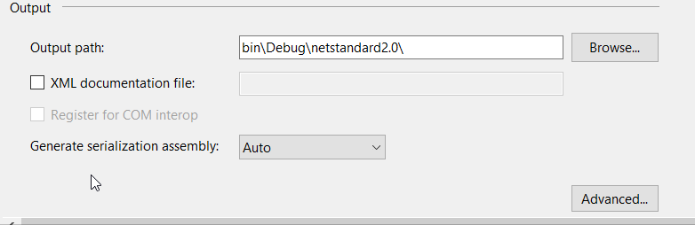

The HomoIcon Tool
=================

The HomoIcon tool generates a part of the `Qbservable` implementation on the basis of the public `Observable` API.

When do I use the tool?
-----------------------

Whenever an `Observable` operator is added, removed, changed or its documentation is changed, the homoicon tool
needs to be executed to keep the `Qbservable` and the `Observable` implementation in sync.

How do I use the tool?
----------------------

 1. Apply your changes to the `Observable` API.
 2. Enable the XML documentation in the _System.Reactive_ and the _System.Reactive.Observable.Aliases_ project properties.
    
 3. Rebuild the Rx solution.
 4. You should have now the dll and xml files in the `System.Reactive\bin\Debug\netstandard2.0` and `System.Reactive.Observable.Aliases\bin\Debug\netstandard2.0`
    folders.
 5. Build and execute the HomoIcon tool.